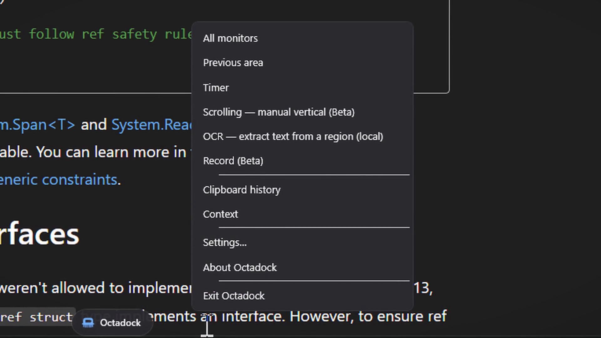

# Octadock

Free, local capture tools for Windows 10 (2004+) and Windows 11. MIT licensed.

Capture a region, window, display, or scrolling viewport. Keep recent shots on a small shelf, annotate them, extract text, dictate, read aloud, and collect evidence into local Context bundles.



## Download

Get the Windows installer from [octadock.com/download.html](https://octadock.com/download.html). Run Setup, install, and open Octadock from Start. A portable ZIP is also available. Windows 10 (2004+) and Windows 11, x64. No account or separate .NET installation is required.

This is an unsigned 0.3.0-alpha.2 preview. Windows may display a SmartScreen warning. Verify the source and SHA-256 before deciding whether to run it. Both the installer and portable release contain the same reviewed desktop payload.

## Free and local

All features are available without an account, activation, trial, device limit, or subscription. The desktop app has no telemetry, licensing server, automatic updater, cloud speech provider, remote AI process launcher, or automatic model downloader. Communication between the CLI and desktop app uses a local named pipe.

Captures, history, settings, annotations and models live in `%LOCALAPPDATA%\Octadock`. Exports go to folders you select. Other software may sync those folders; Octadock itself does not upload them.

## Run

Install the Windows release and open Octadock from Start, or extract the portable ZIP and run `publish/octadock/Octadock.exe`. The installer uses `%LOCALAPPDATA%\Programs\Octadock`; user data stays in `%LOCALAPPDATA%\Octadock` and is preserved when uninstalling. Builds in this branch are unsigned development releases.

Default shortcuts: **Ctrl+Shift+4** selects an area, **Ctrl+Shift+3** captures the full screen, and **Ctrl+Shift+2** toggles dictation. Configure shortcuts in Settings. Scrolling capture is manual: select the scrollable content, scroll with overlapping viewports, then click Finish. You can pause without ending the session.

The dock remembers a separate position for each monitor. History rearranges its controls on narrow screens, and utility windows fit within the available work area.

## Local voice models

Read-aloud uses installed Windows voices. Dictation requires a model already on disk. In **Settings → Voice → Advanced**, choose **Import**:

- **Parakeet:** choose a folder containing `encoder.int8.onnx`, `decoder.int8.onnx`, `joiner.int8.onnx`, and `tokens.txt` for the supported TDT 0.6B v3 int8 model. Exact sizes and SHA-256 hashes are pinned in `ParakeetModelStore.cs`. Imports are verified before installation.
- **Whisper:** select a GGML `.bin` model matching the chosen variant. The import checks its header and copies it into the local models directory. This is a format check, not a cryptographic authenticity guarantee.

Octadock does not download model files. Existing installed models remain usable. Legacy cloud provider preferences migrate to a local engine. Speech models retain their upstream licenses; see About and the license accompanying each model.

## Local export

The former AI handoff opens **Local export**. Attach captures, notes, clipboard content and files, inspect the Markdown, then copy it or save a bundle. Local OCR, text-secret redaction and visual comparisons remain available. Octadock does not run Codex, Claude or a remote image generation service.

## Build and verify

Prerequisites: Windows 10 (2004+) or Windows 11, Git, the .NET 8 SDK, and PowerShell 7 (recommended). Node 22 LTS is recommended for website validation (minimum Node 20). Visual Studio is optional. Dependency restore requires network access on a fresh machine; the built application does not. No API keys, account, database server or `.env` file are needed.

Clone and run the desktop app from source:

```powershell
git clone https://github.com/achrefbs/Octadock.git
cd Octadock
dotnet restore Octadock.sln
dotnet run --project src/Octadock.App/Octadock.App.csproj -c Release
```

Close any installed Octadock instance from its tray menu first: Octadock runs one instance per user. Development builds use the same local data directory as installed builds; back up that directory before testing storage changes.

For the complete release-readiness check:

```powershell
./build/build.ps1 -Configuration Release
```

The gate installs the locked website dependencies and Chromium, then checks version metadata, the local-only source boundary, website syntax/assets/accessibility/browser behavior, desktop and internal regression tests, self-contained publishing, and the public artifact boundary. Results are written under `artifacts/`; the published app is `artifacts/build-gate/publish/octadock/Octadock.exe`.

For a focused Windows iteration:

```powershell
dotnet test Octadock.sln -c Release
```

Linux/macOS contributors can build and test Core and Data with `bash build/build.sh -c Release`; the desktop app requires Windows. For website-only setup, troubleshooting and contribution conventions, see [Contributing](docs/CONTRIBUTING.md).

Optional native acceptance, with synthetic data and an isolated profile:

```powershell
dotnet build tools/acceptance/DesktopProbe/DesktopProbe.csproj -c Release
./tools/acceptance/DesktopProbe/bin/Release/net8.0-windows10.0.19041.0/DesktopProbe.exe ./artifacts/desktop-probe
```

This opens test windows briefly on connected displays and saves renderings and JSON evidence. It does not register integrations or read your capture library.

## Structure

- `src/Octadock.Core`: settings, geometry, commands, storage contracts and local packet models.
- `src/Octadock.Data`: SQLite persistence.
- `src/Octadock.Platform.Windows`: capture, OCR, audio, local speech, monitor and OS integration.
- `src/Octadock.App`: WPF dock, shelf, history, settings, annotations and local exports.
- `src/Octadock.Cli`: local command client.
- `tests`: regression tests. `tools/acceptance`: optional hardware probes.
- `web`: static website with local assets. `tools/internal`: research tooling excluded from desktop release artifacts.

## Release status

This is **0.3.0-alpha.2**, the free/local desktop design refresh. See [current status](docs/PROJECT-STATE.md), [testing](docs/TESTING.md), and [contributing](docs/CONTRIBUTING.md). Historical plans are superseded by [the local-software contract](docs/LOCAL-SOFTWARE.md).

The current website uses an interactive blue demo as its hero, with matching download and legal pages. The older [design chooser](web/concepts/README.md) is retained as an archive. Hosting and installer details are in [Web and installer](docs/WEB-AND-INSTALLER.md).

The application is Windows software; this change does not add macOS or Linux desktop support. Scrolling capture and audio recording remain Beta. Synthetic tests do not establish compatibility with every GPU, protected window, microphone or monitor topology.

## Known issues

- Scrolling capture and screen recording are Beta: manual vertical scrolling only, video-only recording with optional audio opt-ins.
- The annotation editor Text tool does not open its inline text box in some sessions.
- The Context window does not refresh after Add to Context until it is reopened; the items are saved and export correctly.
- No GIF export, pinning or upload provider yet.
- Builds are unsigned; publisher signing is being prepared. See [Code signing](docs/CODE-SIGNING.md) for the actual setup status.

## License

[MIT](LICENSE), copyright Achref Boularess. Third-party components retain their own licenses.

## Help and contributions

Questions and bug reports: [GitHub issues](https://github.com/achrefbs/Octadock/issues) or [support@octadock.com](mailto:support@octadock.com). Review logs and screenshots for personal content before sharing them. Report vulnerabilities privately using [SECURITY.md](SECURITY.md).

Start with the [documentation guide](docs/README.md) and [contribution guide](CONTRIBUTING.md). Maintained code is on `main`; older design, recovery and paid-beta branches are historical and do not describe the current free/local app.
