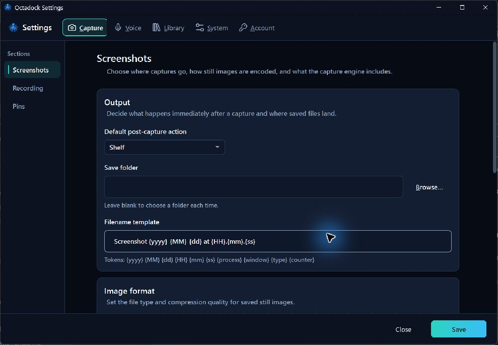
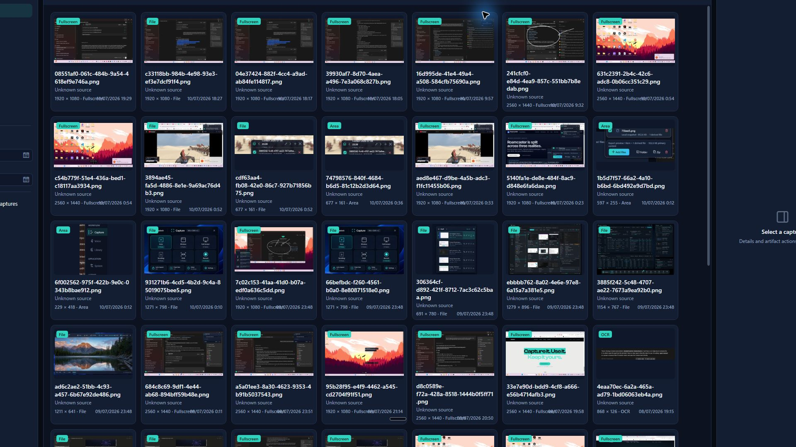
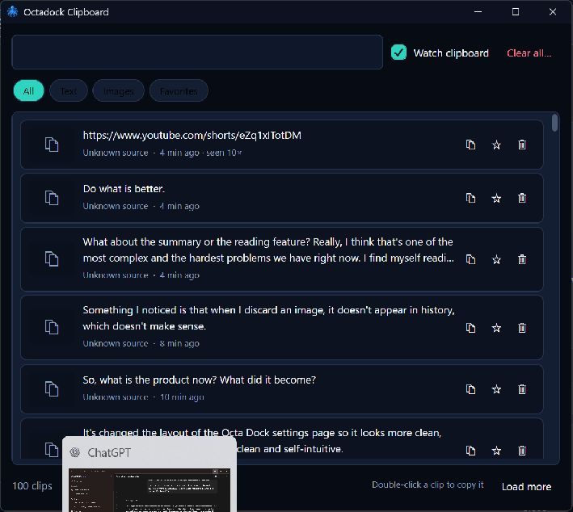
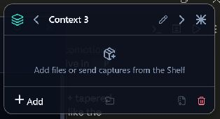

# Octadock window audit — 2026-07-10

Scope: the four management surfaces the founder identified as inconsistent.
Target: preserve the compact, image-first character of the Shelf, capsule, and
native image viewer while keeping management tasks readable and keyboard-safe.

## 1. Settings — needs structural tightening

- Healthy: navigation is understandable and controls have usable labels.
- Risk: it reads as a generic control panel; opaque nested cards, wide fields,
  and the tall header/footer create more visual weight than the floating product.
- Change: smaller default window, tighter content width, glass-backed sections,
  compact navigation/footer, and a short entrance transition.

## 2. History — unhealthy at floating-window scale

- Healthy: capture thumbnails and filtering are functional.
- Risk: the maximized five-column shell consumes the desktop, the permanently
  open empty inspector wastes space, and large cards turn a utility into a media
  manager.
- Change: smaller default window, denser cards, narrower filters, and an inspector
  that only occupies width after a capture is selected.

## 3. Clipboard — functional but visually separate

- Healthy: search, filters, favorites, copy, and deletion are available.
- Risk: there is no product-level header, the rows are heavy, and legacy glyphs
  do not match the Lucide icon language used by the good surfaces.
- Change: compact identity rail, one search row, glass list surface, denser rows,
  Lucide actions, and a smaller default footprint.

## 4. Context — broken hierarchy and readability

- Healthy: the intended workflow is compact and local.
- Risk: the 314px shell is too small for names and actions, translucent content
  competes with whatever is underneath, and the header declared fewer columns
  than it used, causing controls to collide.
- Change: repaired header grid, readable opaque-glass surface, larger compact
  footprint, taller item region, explicit empty-state action, and file drop.

## Evidence limits

This pass used fresh rendered screenshots and code inspection. Keyboard traversal,
high contrast, reduced transparency, mixed DPI, and screen-reader announcements
still require focused runtime verification after the rebuilt executable is opened.
