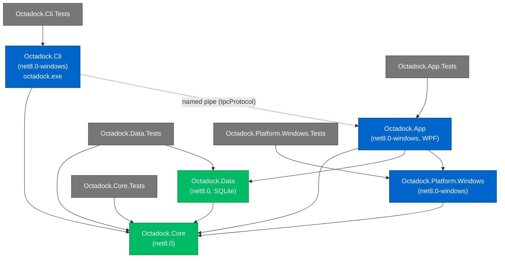

# Octadock Architecture

This document expands [ADR-001](specs/architecture-adr.md) into the as-built
layering of the Octadock solution: how the projects fit together, how a capture
flows from a hotkey to the Capture Shelf, how DPI and multi-monitor coordinates
are handled, where data lives on disk, and how the application is composed through
dependency injection.

For the dated product-state snapshot, see [PROJECT-STATE.md](PROJECT-STATE.md).

Octadock is a Windows desktop app in C#/.NET 8, WPF for the UI, with Win32/WinRT
interop isolated behind interfaces. The guiding principle is that **all logic that
does not strictly need Windows lives in a platform-agnostic library** so it can be
unit-tested on any OS, and **everything that touches Win32/WinRT/WPF is confined to
Windows-only projects** behind Core abstractions.

## Project layering

| Project | TFM | Role | Depends on |
| --- | --- | --- | --- |
| `Octadock.Core` | `net8.0` | Domain models, geometry, settings, command parsing, project serialization, retention, IPC contract, and the abstractions the other layers implement. | (none) |
| `Octadock.Data` | `net8.0` | SQLite persistence for `captures`, `actions`, `pins`, `settings`, and clipboard clips. | Core |
| `Octadock.Platform.Windows` | `net8.0-windows` | Win32/WinRT implementations: capture, monitors/DPI, hotkeys, window enumeration, OCR, recording. | Core |
| `Octadock.App` | `net8.0-windows` (WPF) | Tray shell, overlays, Capture Shelf, editor, pins, history, settings; hosts the IPC pipe server. | Core, Data, Platform.Windows |
| `Octadock.Cli` | `net8.0-windows` | `octadock.exe` — validates and forwards automation commands to the running app. | Core |
| `Octadock.Core.Tests` | `net8.0` | Unit tests for Core. | Core |
| `Octadock.Data.Tests` | `net8.0` | Unit tests for Data. | Core, Data |
| `Octadock.Cli.Tests` | `net8.0-windows` | Unit tests for CLI option parsing and behavior that can run headless. | Core, CLI |
| `Octadock.Platform.Windows.Tests` | `net8.0-windows` | Unit tests for testable Windows-platform capture/recording helpers. | Core, Platform.Windows |
| `Octadock.App.Tests` | `net8.0-windows` | Unit tests for App-layer helpers that can run headless. | Core, Data, Platform.Windows, App |

`Core` is the only leaf. Because it has no Windows dependencies, both it and
`Data` (SQLite is cross-platform) build and test on Linux/CI, which keeps the bulk
of the business logic under continuous, OS-independent test.

### Dependency diagram



Solid arrows are compile-time project references. The dashed arrow is the runtime
IPC channel from the CLI to the tray app (see [Automation and IPC](#automation-and-ipc)).

## Process model

- **One tray app process.** A single-instance guard ensures only one
  `Octadock.exe` runs per user session.
- **A hidden message window** receives `WM_HOTKEY` for global hotkeys and handles
  `octadock://` protocol activation.
- **A named-pipe server** inside the app accepts forwarded commands from
  `octadock.exe` and from second-instance protocol launches, routing them to the
  same command dispatcher the hotkeys and tray menu use.
- No always-on background service in v1. Optional launch-at-login is a per-user
  registry run key (or an installer startup task).

## The capture pipeline

A capture flows through the same pipeline regardless of trigger (hotkey, tray
menu, protocol URL, or CLI):

1. **Trigger → command.** A hotkey/tray action maps directly to a `CommandType`;
   a `octadock://` URL or `octadock.exe` invocation is turned into a
   `OctadockCommand` by `CommandParser` (in Core). The command carries a
   normalized parameter bag with typed accessors (region, action, monitor, units,
   mode, ...).
2. **Route.** The command dispatcher (in the App) selects a capture mode (area,
   window, fullscreen, previous-area, scrolling) and the post-capture action
   (shelf, copy, save, annotate, pin, upload, discard — default: shelf).
3. **Select (interactive modes).** For area capture, a transparent, topmost,
   per-monitor `SelectionOverlay` shows a crosshair, live dimensions, and a
   magnifier. The window picker highlights candidate windows. If coordinates were
   supplied on the command, the selection is preloaded or the capture runs
   immediately.
4. **Hide own UI.** Octadock-owned windows call
   `SetWindowDisplayAffinity(WDA_EXCLUDEFROMCAPTURE)` where supported (Windows 10
   2004+). Where exclusion is unavailable, the app hides its windows before
   grabbing frames so the shelf and overlays never appear in the result.
5. **Capture.** The `CaptureEngine` abstraction (implemented in
   Platform.Windows) uses GDI BitBlt for area captures and all-monitor captures.
   It prefers `Windows.Graphics.Capture` for window and single-monitor captures,
   then falls back to GDI/PrintWindow-style paths when WGC is unavailable or
   fails. The result is a bitmap plus metadata: monitor id, physical pixel size,
   DPI scale, and (when available) the source process/window and a hashed HWND.
6. **Persist and thumbnail.** The image is written under `Captures\YYYY\MM\DD\`
   using the filename template, a thumbnail is generated off the UI thread into
   `Thumbnails\`, and a `captures` row is recorded in SQLite (via Data).
7. **Shelf and action.** The capture appears on the Capture Shelf, anchored to the
   active monitor's bottom-left work-area corner (above the taskbar). The
   requested post-capture action runs: copy to clipboard, save, open the
   annotation editor, create a pin, or discard (soft-delete).

Retention runs opportunistically (never blocking capture): the `IRetentionService`
computes a plan for the configured window and purges expired captures and their
files, plus long-soft-deleted items.

## DPI and multi-monitor handling

- The app is **per-monitor DPI aware**. WPF renders in device-independent pixels
  (DIPs, 96-DPI baseline); Win32 capture works in physical pixels.
- **Coordinates are stored in physical pixels.** The public automation surface
  accepts physical pixels by default and offers `units=dip` for DIP input, which
  is converted against the target monitor's scale. The virtual-screen top-left is
  the origin.
- Region rectangles use Core's `PixelRect`; a command's `Region` is only
  populated when all of `x`, `y`, `width`, and `height` are present.
- The **shelf anchor is computed per monitor from the work area**, not the full
  bounds, so it sits correctly regardless of taskbar position or auto-hide.
- Each capture records its `monitorId` and `dpiScale`, so history and re-open
  behave correctly on mixed-DPI setups. Mixed-DPI is part of the manual test
  matrix (see [TESTING.md](TESTING.md)).

## Data storage layout

All user data lives under a single root, resolved by `IStoragePaths`
(`StoragePaths`), defaulting to:

```
%LOCALAPPDATA%\Octadock\
├─ Captures\YYYY\MM\DD\<id>.png     still captures, foldered by date
├─ Projects\                        .octadock annotation project packages
├─ Recordings\YYYY\MM\DD\<id>.mp4   intended managed recording location
├─ Thumbnails\<id>.jpg              shelf/history thumbnail cache
├─ TempExports\                     scratch files for drag/drop and clipboard
├─ Logs\                            rolling logs
├─ AiSessionLogs\YYYY\MM\DD\*.log   stdout/stderr logs for wrapped runs
├─ CrashReports\                    opt-in local redacted crash report JSON
└─ octadock.db                      SQLite metadata database
```

Capture, thumbnail, and recording paths are stored **relative to the root with
forward slashes** for portability; `IStoragePaths` converts to/from absolute paths
and tolerates either separator.

Current recording caveat: the active `RecordingController` writes MP4s to the
configured capture save directory, or `Videos\Octadock` when no save directory is
configured, and stores that absolute path in history. The managed
`Recordings\...` helper exists in Core but is not the controller's active output
path yet.

### SQLite schema (Octadock.Data)

- `captures` — id, type, created_at, source_process, source_window, hwnd_hash,
  monitor_id, pixel_width, pixel_height, dpi_scale, original_path,
  thumbnail_path, project_path, duration_ms, deleted_at.
- `actions` — id, capture_id, action_type, created_at, destination,
  metadata_json.
- `pins` — id, capture_id, x, y, width, height, opacity, click_through,
  monitor_id, last_visible_at, image_path.
- `clipboard_clips` — id, kind, created_at, last_seen_at, seen_count,
  source_process, source_window, format_name, text, image_path, thumbnail_path,
  content_hash, size_bytes, is_favorite, deleted_at, metadata_json.
- `settings` — key, value_json, updated_at.

### `.octadock` project package

An annotation project is a zip archive (handled by `IProjectSerializer`):

```
Example.octadock/
├─ manifest.json     format/version, canvas size, base image + objects references
├─ original.png      the flattened source raster
├─ preview.png       a rendered preview
├─ objects.json      editable vector annotation objects (arrow/rect/text/blur/...)
└─ assets\           embedded images used by image annotations
```

## Automation and IPC

The CLI and the protocol handler share one contract, defined in
`Octadock.Core.Ipc.IpcProtocol`, so the CLI (which references only Core) and the
WPF app agree on names and shapes:

- **Pipe name** — `IpcProtocol.PipeName(Environment.UserName)` derives a
  per-user pipe (`Octadock.Ipc.v1.<hash>`) so multiple users or fast-user-switching
  never collide.
- **Request** — `IpcRequest` carries the raw argument vector
  (`Arguments`) exactly as received, plus a protocol `Version`.
- **Response** — `IpcResponse` carries `Success`, a human-readable `Message`, and
  an `ExitCode`.
- **Serialization** — one JSON object per line via
  `IpcProtocol.SerializeRequest` / `DeserializeResponse`.

`octadock.exe` validates the command locally with `CommandParser` (fast failure on
bad input), connects to the pipe, launches `Octadock.exe` from its own directory if
nothing is listening, then writes one request line and reads one response line. The
tray app re-parses the forwarded arguments and dispatches them with full platform
context. See [AUTOMATION.md](AUTOMATION.md).

## Dependency injection composition

Registration is split so each layer owns its own services and Core stays free of
Windows types:

- **`AddOctadockCore(dataRoot?)`** (in `Octadock.Core.DependencyInjection`)
  registers the platform-agnostic singletons: `IClock` (`SystemClock`),
  `IStoragePaths` (`StoragePaths`, defaulting to `%LOCALAPPDATA%\Octadock`),
  `ICommandParser`/`ICommandFormatter`, `IFilenameGenerator`, `IProjectSerializer`,
  `ISettingsService`, and `IRetentionService`.
- **Octadock.Data** registers the SQLite connection factory and the repository
  implementations of the Core store abstractions.
- **Octadock.Platform.Windows** registers the Win32/WinRT implementations of the
  capture, monitor/DPI, hotkey, OCR, recording, scrolling-capture, audio capture,
  local Whisper STT, startup/protocol registration, file association, and
  single-instance abstractions.
- **Octadock.App** builds the host, calls each layer's registration extension, and
  adds its own WPF view-models, windows, tray shell, Dock/HUD, capture
  coordinator, OCR service, recording controller, dictation controller, file
  preview service/providers, notification service, command dispatcher, and the
  IPC pipe-server hosted service.

Because the App composes concrete implementations only at startup, the core loop,
parsing, retention, and persistence are all exercised in tests against fakes and
in-memory SQLite without any Windows dependency.

## Consequences and revisit points

Per the ADR, WPF + Win32/WinRT gives the fastest credible route to the
capture-to-shelf feel. The capture and recording engines are isolated behind
interfaces so their internals (for example a move to Direct3D/Media Foundation, or
a WinUI 3 settings surface) can be replaced without touching the core loop. OCR is
pluggable behind a provider interface; the current default is `Windows.Media.Ocr`,
while Windows AI Text Recognition and Tesseract remain declared placeholders.
