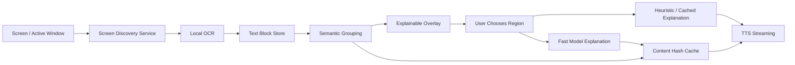

# Read-Aloud And Screen Discovery Spec

Status: **historical — ambient discovery superseded**
Last updated: 2026-07-04

Read aloud remains shipped as an explicit user action. The proposed passive
screen-discovery layer conflicts with current product strategy and is not an
active roadmap item. Use `../ROADMAP.md` for current work.

## Summary

The initial read-aloud feature proves the workflow: source text is extracted,
explained by AI, synthesized by ElevenLabs, and played locally. The next version
should be faster and more magical by turning this into a screen discovery system.

The desired experience is not "draw a rectangle every time." The desired
experience is: Octadock already understands much of what is visible, shows a
light overlay over meaningful chunks, and can explain or read one when asked.

## Current MVP

Command:

```powershell
octadock read --text "..."
octadock read --filepath "C:\path\file.txt"
octadock read --clipboard
octadock read --area 100,120,800,600
octadock read --stop
```

Entry points:

- tray menu: `Read Region Aloud`;
- dock action: `Read`;
- CLI aliases: `read`, `read-aloud`, `explain`, `summarize`.

Providers:

- temporary explanation provider: local Codex CLI or Claude CLI;
- speech provider: ElevenLabs text-to-speech.

Privacy boundary:

- source text goes to the explanation provider;
- ElevenLabs receives only the generated explanation, not the full source text;
- protocol-triggered `octadock://read` is blocked because it can trigger
  AI/TTS work.

## Pain Points

- Codex/Claude CLI startup is slow because those tools are agent CLIs, not
  low-latency summary APIs.
- Speech waits for the explanation and then waits for a full audio file.
- Manual selection is useful but not enough for a magical desktop experience.
- OCR is repeated even when the same text is selected again.

## Target Architecture



## Screen Discovery

The discovery layer should create a local map of visible text and UI regions.

Recommended model:

- `ScreenMap`: snapshot of visible displays/windows and discovered regions.
- `ScreenRegion`: physical bounds, monitor, window title/process, z-order,
  timestamp, text hash, and source type.
- `TextBlock`: OCR text, line boxes, confidence, language, layout hints.
- `ExplainableRegion`: grouped text blocks with semantic type and action menu.

Discovery triggers:

- manual hotkey: "show explainable regions";
- mouse pause over a text-heavy area;
- active window changed;
- capture/dock opened;
- optional low-frequency background scan when idle.

Avoid constant work:

- hash screen tiles or OCR text;
- skip unchanged windows;
- throttle by app, monitor, and interaction state;
- run OCR at lower priority when the user is actively typing or dragging.

## Grouping Heuristics

Group OCR lines into meaningful chunks before any AI call:

- proximity and alignment;
- shared window/control bounds;
- paragraph spacing;
- code indentation;
- repeated table columns;
- dialog/title/body/action layout;
- notification shape;
- known file preview panels;
- active selection/hover position.

Semantic labels:

- paragraph/article;
- error/warning;
- code block;
- table;
- chat/email thread;
- settings/control panel;
- dialog/modal;
- notification;
- file preview;
- unknown text group.

## Explanation Strategy

Use the cheapest sufficient path:

1. **Cached**: if the same text hash has an explanation/audio, use it.
2. **Heuristic**: for short UI strings and known patterns, explain locally.
3. **Fast model**: default for paragraphs, errors, code snippets, and dense UI.
4. **Deep model**: only when explicitly requested or when complexity demands it.

Output should be spoken prose:

- not a transcript;
- no Markdown tables;
- no long quotes;
- short by default;
- style-controlled: `brief`, `explain`, `detailed`, `technical`, `eli5`.

## TTS Strategy

Current:

- ElevenLabs full-file synthesis to MP3, then local playback.

Target:

- ElevenLabs streaming endpoint;
- start playback as soon as initial audio chunks arrive;
- cache generated audio by `(voice, model, explanation hash)`;
- allow stop/replay from dock/tray;
- avoid sending raw source text to TTS.

## Overlay UX

Hold a hotkey or click a dock action to reveal explainable regions.

Expected behavior:

- subtle outlines over discovered chunks;
- no heavy cards covering content;
- hover highlights the current group;
- click opens a compact action menu;
- default action can be read/explain aloud;
- manual rectangle selection remains available for missed regions.

Possible commands:

- `Explain this`;
- `Read aloud`;
- `Copy text`;
- `Capture`;
- `Pin`;
- `Ask follow-up`.

## Implementation Backlog

- Add `IScreenDiscoveryService`, `IScreenMapStore`, and `IExplainableRegionGrouper`.
- Add local OCR block cache keyed by region/window/text hash.
- Add a discovery overlay separate from capture selection overlay.
- Add explanation/audio cache.
- Add streaming ElevenLabs playback.
- Add settings UI for read-aloud and discovery.
- Replace CLI explainer default with a low-latency API provider.
- Add tests for grouping and cache-key stability.
- Add manual verification checklist for multi-monitor/high-DPI discovery.

