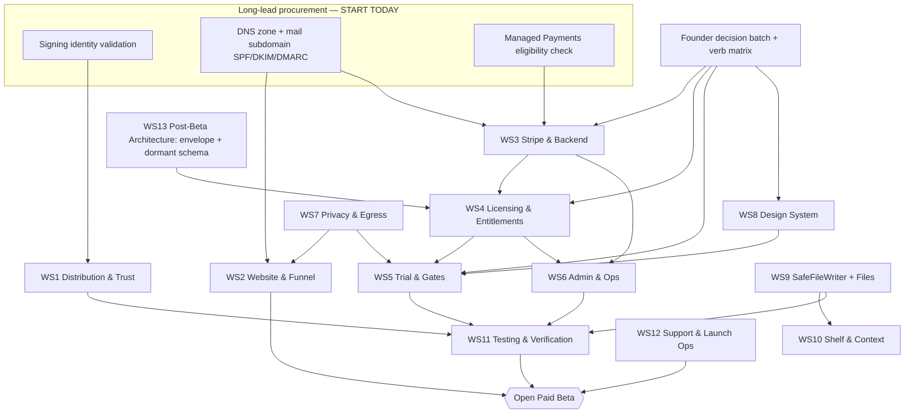

# Octadock 0-to-100 Master Execution Plan

Created: 2026-07-06 · Baseline: `claude/pensive-cray-31e0af` @ `c9ae200` · App: `0.2.0-alpha.0`

This plan turns the three prior wargames (UI/files/context, pricing/accounts, launch pre-mortem) and current code reality into a single executable path to a **paid beta**. It is not a roadmap rewrite. It is the sequence, the gates, and the first sprint.

**Authority model used to resolve conflicts** (higher wins): (1) explicit founder decisions in committed decision docs; (2) current code reality; (3) latest Codex audit of a Fable result; (4) latest Fable wargame result; (5) strategy/spec docs; (6) older roadmap/aspirational docs.

**Import note:** this plan was generated in the older `pensive-cray-31e0af` worktree, where `PLAN_TO_MAKE_PLAN.md` and the launch pre-mortem `CODEX_AUDIT.md` were not present. On current `main`, both inputs exist. Codex audited this imported plan against those files in `docs/wargames/octadock-0-to-100-master-execution-2026-07/CODEX_AUDIT.md`; use that audit as the adoption note for the plan.

Risks are cited by ID `R1`–`R40` from `docs/wargames/octadock-launch-premortem-unknown-unknowns-2026-07/WARGAME_RESULT.md`. Workstreams are `WS1`–`WS13`.

**Execution labels** (used throughout instead of P0/P1/P2):

| Label | Meaning |
| --- | --- |
| **Critical Path Gate** | Blocks paid beta. Must be built and verified before checkout opens. |
| **Parallel Now** | Start immediately; runs alongside the critical path without blocking it. |
| **Architecture Now** | A decision or dormant schema/format choice that must be made now even though the feature ships later — getting it wrong forces a live migration. |
| **Fast Follow** | First 30 days after beta opens. |
| **Deferred** | Before public 1.0 or later; explicitly out of beta scope. |

---

## 1. Executive Readout

- **Verdict: not launch-ready, but the path is clear and short if sequenced correctly.** The desktop app is a real, capable `0.2.0-alpha` utility. Every component that turns it into a *product you can sell* — installer, code signing, website, Stripe integration, license service, trial, gate, admin, transactional email — is 100% greenfield. `Octadock.sln` holds five client projects and five test projects and **zero** server/web code.
- **The shape of the work:** you are not "adding payments" to a product; you are building the entire commercial spine from scratch and bolting it onto a privacy utility whose current copy and behavior actively contradict the commercial plan (unconsented model downloads, a cloud call labeled "local AI", non-atomic file saves). The desktop feature work is mostly polish and honesty; the money path is mostly net-new engineering.
- **The 7 Critical Path Gates that decide whether beta can open:** (1) signed, self-contained installer with warmed SmartScreen reputation (WS1, R1/R10); (2) license service with signature-verified, idempotent webhooks + reconciliation + refund→revoke (WS3/WS4, R3/R12/R21); (3) manual key-entry UI + proven activation (WS5, R2); (4) trial gate that is visible and accessible at every entry point (WS5, R16/R18); (5) SafeFileWriter before any save reaches a payer (WS9, R23); (6) copy/egress honesty + consent (WS7, R6/R7); (7) tax posture + legal set + minimal admin visibility (WS2/WS3/WS6, R5/R19/R22/R29).
- **Biggest sequencing correction:** the current plan builds a role-based enterprise admin console (MFA + 5 roles + PII redaction + CSV) as a launch blocker while the money-path safety nets (reconciliation poller, refund revocation, alerting, email) sit in "P1". **Invert it.** Ship money-path safety nets and a one-page launch-health console for beta; defer the enterprise admin. And gate the trial at the ~8 singleton service seams, never the scattered UI call sites.
- **Trust before polish.** The requested 100% visual overhaul is real and wanted, but it is Deferred. Only the ~6 commercial surfaces get design tokens and accessibility before beta. Signing, installer, website, Stripe, license service, and support are what let you charge money; a prettier dock is not.
- **Start today (long-lead clocks that cost hours and buy weeks):** submit code-signing identity validation, check Stripe Managed Payments eligibility in the live dashboard, and provision DNS + a mail subdomain with SPF/DKIM/DMARC. Every week these slip pushes the reputation/deliverability warm-up window past the launch date.
- **Roughly:** the desktop app is ~70% of a shippable v1 product experience; the commercial layer is ~5% (specs only). The beta date is gated by the commercial layer and the long-lead procurement, not by the app.

---

## 2. Current Reality

Status legend: **Built** (implemented + wired) · **Partial** (works but missing promised behavior) · **Not built** (greenfield) · **Unknown** (needs on-device verification).

### Desktop product (mostly Built)

| Component | Status | Evidence | Notes |
| --- | --- | --- | --- |
| Capture (area/window/full/timer/previous) + manual vertical scrolling | Built | `CaptureCoordinator`, `CaptureEngine`, `ScrollingCaptureEngine` | Mixed-DPI/multi-monitor correctness is manual-test-only, ungated (R25). |
| Capture Shelf + video cards | Built | `ShelfService`, `ShelfItemViewModel` | Save paths are direct overwrites (R23). |
| Floating pins | Built | `PinService` (`PinCaptureAsync`/`PinImageFileAsync`/`PinFromClipboardAsync`), restore `App.xaml.cs:169-175` | New-pin creation must be gated post-expiry; restore stays exempt. |
| Annotation editor | Built | `AnnotationService.cs:104-135`, `OctadockProjectSerializer.cs:12-29` | Copy-on-write to `.octadock`; never writes back to source (good). |
| Local history + retention | Built | `HistoryViewModel`, repositories, `RetentionService` | Save-from-history is a direct overwrite (R23). |
| Clipboard history | Built | `ClipboardMonitor`, `ClipboardHistoryService`, default-on `SettingsSections.cs:108` | Keeps recording + writing PNGs; unmapped in the post-expiry matrix (R17). |
| Text transforms (28) | Built | `TextTransforms`, `TextToolsWindow` | Local-only. |
| Local OCR | Partial | `WindowsMediaOcrProvider.cs:15-21` | Only Windows.Media.Ocr; unverified on clean unpackaged installs (R24); file OCR writes no history row. |
| Dictation (Parakeet default + Whisper + opt-in OpenAI) | Partial | `SpeechToTextProviderFactory.cs:34-61` | Fails offline on fresh install until a 466–670 MB model downloads (R6). |
| Read-aloud (Windows TTS + opt-in ElevenLabs) | Built | `ReadAloudService.cs` | "Explain aloud" pipes captured text to cloud CLIs, mislabeled "local AI" (R7). |
| File preview (csv/tsv, json, log, md, ~30 text/code, 17 image) + fallback | Partial | `AppServiceCollectionExtensions.cs:65-70`, `FilePreviewService.cs:98-105` | UNC blocked in preview (`:71-88`) but not in the add-to-dock copy path (R32). No PDF/Office/archive. |
| Explorer Open-With (29 exts + image add-to-dock) | Built | `FileAssociationRegistration.cs`, `App.xaml.cs:556-575` | Always-on HKCU, no settings toggle; failures silent (R16). |
| `octadock://` protocol + CLI | Built | `CommandType.cs:8-34` | Settings-gated; dictation blocked from protocol; UNC not guarded on add/pin (R32). |
| Screen recording (video-only MP4) | Partial | `RecordingController`, `MediaFoundationRecordingEngine` | Mic/system audio disabled; a $49 comparison landmine if marketed (R26). |
| Crash reporting (local, opt-in, off by default) | Built | `CrashReportService.cs:12-18,152-190` | Path-token redaction only; no uploader; provider error bodies can reach logs (R33). |

### Commercial layer (all Not built)

| Component | Status | Evidence | Notes |
| --- | --- | --- | --- |
| Installer / code signing / auto-update | Not built | `build/release.ps1:271-293` (framework-dependent zip, no RID/SelfContained); grep signtool/Squirrel/Velopack = 0 | Needs .NET 8 Desktop Runtime; unsigned; no update mechanism (R1/R10/R14). |
| Website / DNS / CDN | Not built | No web project; only `docs/design/HOMEPAGE-CONCEPT-2026-07-06.md` | Draft CTA is "Join Waitlist", no Download button, Pro framed buyable — sells the wrong funnel (R9). |
| Trial / license / entitlement code | Not built | grep `license\|trial\|entitlement` = 0 | 100% greenfield (R2/R11). |
| Stripe / webhook / license service | Not built | grep `Stripe\|webhook\|AspNetCore` = 0 | No server project exists (R3/R12). |
| Ed25519 signing / asymmetric crypto | Not built | grep `Ed25519\|ECDsa\|RSA` = 0; only SHA-256 hashing | Signing key custody + envelope undesigned (R15/R20). |
| Admin panel | Not built | `ADMIN_PANEL_SPEC.md` (doc only) | Over-scoped for a team of one (R28). |
| Transactional email | Not built | `ADMIN_PANEL_SPEC.md:450` (provider still a Blocking open question) | Cold-domain deliverability risk (R4). |
| Machine identity primitive | Not built | grep MachineGuid/HWID = 0; only IPC pipe hash `IpcProtocol.cs:26-31` | "3 devices" is undefined (R13). |
| Trial clock integrity | Not built | only `SystemClock.UtcNow` | No rollback/monotonic anchor (R36). |
| SafeFileWriter / revision layer | Not built | every save is direct overwrite: `ShelfItemViewModel.cs:199`, `HistoryViewModel.cs:472`, `PinWindow.xaml.cs:400`, `FilePreviewService.cs:267` | Known data-loss defect class (R23). |
| Context (packaging/export) | Not built | grep `Context` = only WPF `DataContext` | Planned; sold in homepage finale as if shipped (R8). |
| BYO-key secure storage + UI | Partial | env-var only `OpenAiSttProvider.cs:18-19` | No UI, no Credential Manager; generic `OPENAI_API_KEY` adopted silently (R7/R33). |
| Telemetry transport | Not built (by design) | `CrashReportService` local-only | Downloads/trial/version tiles have no permissible source (R28/R29). |

**Net position:** the app is a strong local utility. The business around it does not exist yet in code — not partially, but not at all. The plan below treats the desktop side as *honesty + a few safety fixes* and the commercial side as *net-new build with long procurement lead times*.

---

## 3. Locked Decisions

These are settled. Do not re-litigate; challenge only with material new evidence.

| Decision | Source | Authority Rank | Type |
| --- | --- | --- | --- |
| Stripe is the payment provider (Checkout on standard Payments; Managed Payments a later swap) | `PAYMENT_PROVIDER_DECISION.md` | 1 (founder) | Confirmed |
| Free download; 14-day full local trial on first run; no account, no card; one 7-day extension; reset-by-wipe accepted | `TRIAL_AND_PURCHASE_FLOW.md`, README locked list | 1 | Confirmed |
| Local license: $49 beta / $59 at 1.0, one-time, 3 devices, 12 months updates, optional $19/yr renewal; keeps working after updates end | `PAYMENT_PROVIDER_DECISION.md`, `CODEX_AUDIT.md` | 1/3 | Confirmed |
| No permanent free tier in paid beta | README locked list | 1 | Confirmed |
| No first-party accounts in v1; identity = license key + purchase email + Stripe portal | `PAYMENT_PROVIDER_DECISION.md` | 1 | Confirmed |
| Pro is waitlist-only until hosted metering/quota/dunning exists; no unlimited hosted AI in Local | `CODEX_AUDIT.md`, README | 1/3 | Confirmed |
| Admin panel required before paid beta — **rescoped** to minimal launch-health (this plan, conflict #4) | `ADMIN_PANEL_SPEC.md` (spec) + pre-mortem R28 | 5 + 4 | Strategy doc; rescoped by rank-4 Fable result |
| Local-first + no-silent-uploads are core brand constraints (copy must be corrected to match code) | README, pre-mortem R6/R7 | 1 (constraint) | Confirmed constraint, copy correction required |
| Capture Shelf and Context are separate surfaces; context surface titled "Context" | README, UI wargame Open Questions | 4 | Confirmed |
| AI discovery / AI Sessions permanently dropped (schema migration 6 dropped the tables) | `PROJECT-STATE.md`, README | 2 (code) | Confirmed — do not resurrect |
| BYO keys available to all tiers; move to Credential Manager/DPAPI | `CODEX_AUDIT.md` | 3 | Confirmed; storage is greenfield |
| Writeback = raster images only via a revision layer; SafeFileWriter mandatory before any save | UI wargame `WARGAME_RESULT.md` | 4 | Confirmed |
| "Obsidian Instrument" design direction (teal local / violet cloud-Pro) | pricing `WARGAME_RESULT.md` | 4 | Direction confirmed; full overhaul Deferred |

---

## 4. Open Decisions

Every row blocks something. The **safest default** is what to do if the founder does not decide in time.

| Decision | Why It Matters | Blocks | Safest Default Recommendation |
| --- | --- | --- | --- |
| **Tax / MoR posture** (R5) | Standard Stripe makes you merchant of record; EU/UK VAT owed from sale #1, no threshold | Checkout copy freeze; WS3 | Verify Managed Payments eligibility this week → if eligible, enable it (MoR). If not eligible by copy-freeze, **restrict Checkout billing countries to US/CA for beta**; enable Stripe Tax + OSS/UK before going worldwide. |
| **Email provider + domain** (R4) | Cold `suruslabs.com` will spam-file keys | License delivery; WS3 | Postmark on `mail.octadock.com`, provisioned NOW for warm-up; success-page inline key as the primary surface, email as durable backup. |
| **Admin hosting + auth** (R20) | Signing key + all PII sit behind it | WS6 | Cloudflare Access + WebAuthn in front of a minimal panel; Ed25519 key in a cloud KMS, sign-only, non-exportable, physically separate from the panel host. |
| **Signing cert type/vendor** (R1) | Weeks of lead + reputation warm-up | WS1, the whole schedule | Azure Artifact Signing (~$10/mo). Microsoft's docs say EV no longer bypasses SmartScreen — submit identity validation today; do not wait for EV. |
| **What "3 devices" means + self-serve deactivation** (R13) | Schema is a one-way door | WS4 schema | `machine_hash = SHA-256(HKLM MachineGuid)`, machine-scoped, `device_hash_v` versioned; migrate slot on hash change; LRU self-eviction; self-serve device page (Fast Follow), support-assisted at launch. |
| **Beta buyers' 1.0 entitlement + updates clock** (R14) | Synchronized "not as described" disputes when 1.0 ships | Checkout copy | $49 beta **includes 1.0**; `updates_until = max(purchase + 12mo, 1.0-GA + 12mo)`; publish it on the pricing page. |
| **Context in launch copy** (R8) | Selling vaporware in a $49 checkout | Copy freeze, WS2 | Roadmap page only, "In development — included with the Local license when it ships." Never in checkout bullets. |
| **Refund policy + EU withdrawal mechanics** (R21/R22) | Undefended disputes; withdrawal right extends to 12 months | Checkout, WS2 legal | Voluntary 14-day money-back + Stripe Checkout express-consent-to-immediate-supply checkbox + statutory-rights carve-out in EULA. |
| **Minimum a11y bar for commercial surfaces** (R18) | Screen-reader/keyboard buyers literally cannot pay | WS5/WS8 | Accessibility Insights FastPass (names, roles, focus order, contrast) on the ~6 commercial surfaces as a written no-go. |
| **Downloads metric source** (R9) | Launch morning you cannot tell "SmartScreen ate the funnel" from "nobody came" | Admin tile, WS2/WS6 | Cloudflare Pages/R2 with CDN analytics as the canonical Downloads number. |
| **Stripe Customer Portal vs license-lookup page** (R30) | Portal is subscription-centric; one-time buyers see an empty page, no VAT invoice | Billing copy, WS3 | `invoice_creation=true` on every Checkout session + a license-lookup magic-link page; prove portal behavior for a test-mode one-time purchase before promising it. |
| **Snapshot-vs-reference size threshold for Context** | Bundle integrity vs disk blowup | WS10 schema | Copy ≤ 25 MB into managed storage; reference above with per-item "materialize". |
| **PDF render library + license budget** | Orders any PDF work; AGPL/commercial trap | WS9 (if PDF enters beta) | PDFium-class render-only; no PDF in beta unless separately funded; writeback Deferred. |
| **Migration runner refuses `user_version` > known?** | A future-schema DB opened by an old binary | WS9/WS13 | Verify; add an explicit downgrade guard + friendly message (UI wargame open question). |
| **Import caveat: older worktree baseline** | The generating worktree did not contain `PLAN_TO_MAKE_PLAN.md` or the launch pre-mortem `CODEX_AUDIT.md`; current `main` does | Adoption readiness | Codex rechecked this plan against both files on import. Use this plan with `CODEX_AUDIT.md` as the adoption note. |

---

## 5. Dependency Graph

**Longest chains (read these as the true critical path):**

1. **Signing → installer → reputation warm-up → clean-VM verification → beta.** This is the longest *calendar* chain because reputation accrues over weeks of real downloads. Start signing identity validation today or the beta date is set by this chain, not by engineering.
2. **Decision batch → entitlement envelope (WS13 Architecture Now) → license service (WS3/WS4) → trial + gate (WS5) → live-mode purchase rehearsal (WS11) → beta.** The envelope format must be frozen before the first key issues because shipped verifiers are immortal (R15).
3. **DNS/mail → email warm-up → license delivery proven (WS3/WS11).** Deliverability is a calendar dependency, not an engineering one.
4. **SafeFileWriter (WS9) → every save path → any writeback reaching a payer.** Cheap to build, but it gates the honesty of the whole "annotate/edit" claim (R23).

---

## 6. 0-To-100 Sequence

From today (nothing commercial built) to open beta and the first Fast-Follow items.

| Order | Workstream(s) | Label | Why Now | Depends On | Acceptance Gate |
| --- | --- | --- | --- | --- |
| 1 | WS1/WS2/WS3 procurement + WS7 | **Critical Path Gate** | Signing/email/DNS are calendar-bound; copy corrections are free | Nothing | Signing identity submitted; MP eligibility recorded; `mail.octadock.com` passes SPF/DKIM/DMARC on a test send within 14 days; "fully offline" tooltip + "local AI" label fixed in code |
| 2 | Founder decision batch + verb-matrix ratification | **Architecture Now** | Schema, gate, and copy fork on these | Nothing | Every Open-Decision row marked decided in a dated record; post-expiry verb matrix ratified |
| 3 | WS13 envelope + dormant schema | **Architecture Now** | Immortal verifiers; live-migration avoidance | 2 | `{schema,key_id,payload,sig}` frozen; dormant Pro/Team columns + empty `usage_events` in the initial migration; CI test: today's verifier accepts a synthetic future-schema entitlement |
| 4 | WS1 signed self-contained installer + publish free build | **Critical Path Gate** | Reputation warm-up clock must start before commerce | 1 | Clean Win11 VM (no runtime): download→install→first-run with zero SmartScreen interstitial after warm-up; `signtool verify /pa` passes in CI |
| 5 | WS9 SafeFileWriter + revision + restore | **Critical Path Gate** | Cannot sell a known data-loss defect class | — (parallel with 3-4) | Kill-process-mid-save ×100: original intact or restorable; restore UI discoverable |
| 6 | WS3/WS4 license service v1 | **Critical Path Gate** | The money path | 2, 3 | Spoofed webhook rejected; duplicate event idempotent; refund revokes; hourly reconciliation diff = 0 in rehearsal |
| 7 | WS5 client trial/entitlement module + key entry | **Critical Path Gate** | Client counterpart to 6; gates first-run copy | 3, 6 | Forged DB row doesn't unlock; corruption keeps license; clock rollback freezes countdown; pasted key activates with visible confirmation |
| 8 | WS5/WS8 trial gate at service seams + accessible pill | **Critical Path Gate** | Conversion moment; must be visible + a11y | 2 (matrix), 7, WS8 tokens | Every entry-point row behaves per matrix; Narrator + keyboard completes expiry→buy→activate |
| 9 | WS2 website + legal set | **Critical Path Gate** | Front door + compliance floor + Downloads metric | 1 | Live `/`, `/pricing`, `/privacy`, `/refunds`; Checkout consent checkbox; CDN analytics feed the Downloads tile |
| 10 | WS7 copy/egress + consent finalization | **Critical Path Gate** | Reputational; must precede public copy freeze | 2 | Grep gates pass (no "fully offline" tooltip, no "local AI" on CLI path, no recording/Context in pricing copy); model-download consent card shown before first fetch |
| 11 | WS6 minimal admin + four alerts | **Critical Path Gate** | Launch week needs the system to page the human | 6 | Panel answers "did the last purchase produce a key?" in one glance; all four alerts fire in a forced-failure drill |
| 12 | WS9/WS10 hardening (UNC guard, executable guard, clipboard-pause, egress) | **Critical Path Gate** | Data-loss + credential-theft classes | parallel with 5-7 | UNC add-shelf-item rejected; grep of Logs/CrashReports clean of response bodies/`sk-` after a failure session |
| 13 | WS11 RC verification + two live-mode purchase rehearsals | **Critical Path Gate** | Converts every checklist item to observed behavior | 4-12 | Matrix committed beside the release manifest; both rehearsals < 60 s checkout→activated |
| 14 | WS12 support channel + runbooks + on-call | **Critical Path Gate** | Buyers who can't find support file disputes | 6 | `support@octadock.com` live; top-25 runbooks written; launch-day on-call defined |
| 15 | **Open paid beta** | — | — | 1-14 | First 72 h: reconciliation diff 0, activation ≥ 90%, zero unanswered "paid but no key" |
| 16 | WS5/WS4/WS6/WS7 Fast Follow (self-serve deactivation, update check, consent framework, Credential Manager, offline activation, license-lookup page) | **Fast Follow** | Refinements that follow revenue and real data | 15 | Each item's own acceptance (see workstreams) |

---

## 7. Workstream Plans

Each work item carries: **Status · Evidence · Depends · Blocks · Parallel · Acceptance · Verify · Risk-if-delayed · Copy impact.**

### WS1 Distribution and Trust

Goal: a Windows user can download and run Octadock without a malware warning, a runtime install, or admin rights. **Label: Critical Path Gate.**

- **Sign every release under one stable identity.**
  - Status: Not built · Evidence: grep signtool/AzureSignTool = 0, `build/release.ps1:271-293` · Depends: signing identity validation (long-lead) · Blocks: all trust, R1/R14 · Parallel: WS3/WS4 · Acceptance: `signtool verify /pa` passes in CI on the shipped installer; identity stable across releases · Verify: CI gate + VirusTotal on release hash (0 detections) · Risk if delayed: reputation clock never starts, funnel dies at first double-click · Copy impact: enables "signed installer" claim.
- **Self-contained single-file `win-x64` build inside an installer.**
  - Status: Not built (framework-dependent zip today) · Evidence: no RID/`SelfContained` in any csproj · Depends: — · Blocks: R10, "install without network" · Parallel: signing · Acceptance: clean Win10 2004 / Win11 VM with no .NET runtime and default AppLocker reaches first-run without an interstitial · Verify: clean-VM matrix (WS11) · Risk if delayed: trial never starts on fresh/corporate PCs · Copy impact: "no admin, no runtime install" on the download page.
- **SmartScreen reputation warm-up.**
  - Status: Not built · Evidence: unsigned, zero reputation · Depends: signing + a public download host (WS2) · Blocks: beta open · Parallel: everything · Acceptance: 3–4 weeks of signed free-build downloads before checkout opens; submit each release to microsoft.com/wdsi · Verify: clean-VM shows no "Windows protected your PC" after the window · Risk if delayed: R1 · Copy impact: stop coaching users through SmartScreen (feeds trojan-rehost risk).
- **Publish canonical SHA-256 + single download page.**
  - Status: Not built · Depends: WS2 · Blocks: R1 trojan-rehost · Acceptance: one official download URL with published hash · Verify: hash matches CI artifact · Copy impact: "verify your download".
- **Update-delivery path (in-app check against a signed manifest).**
  - Status: Not built · Evidence: grep updater = 0, `version.json` `releaseDate:null` · Depends: signing, hosting · Blocks: "12 months of updates" claim (R14) · Label for this item: **Fast Follow** (a settings-gated update *check* is enough for beta; full auto-update is Deferred) · Acceptance: app can detect + link a newer signed version; `releaseDate` stamped on every release · Verify: manifest round-trip on VM · Copy impact: don't sell $19/yr renewal in beta until an update can reach a buyer.

### WS2 Website and Public Funnel

Goal: a real download-first funnel that matches the locked plan and is the source of the Downloads metric. **Label: Critical Path Gate.**

- **Static download + pricing page (Cloudflare Pages/R2).**
  - Status: Not built · Evidence: no web project; `HOMEPAGE-CONCEPT-2026-07-06.md` sells "Join Waitlist" + buyable Pro (R9) · Depends: DNS · Blocks: download, Downloads metric, beta open · Parallel: WS3 · Acceptance: hero "Download free trial — 14 days, no account, no card"; $49 Local; Pro column labeled **Waitlist**; Context labeled **In development**; egress table linked; CDN analytics wired · Verify: page live on `octadock.com`; download event visible in analytics · Risk if delayed: no front door, blind Downloads tile · Copy impact: this page *is* the promise surface — every claim maps to [Customer Promise Map in the pre-mortem].
- **Legal set: privacy policy, refund policy, EULA, terms.**
  - Status: Not built · Evidence: repo has zero legal files (only MIT `LICENSE`) · Depends: tax + data decisions · Blocks: first EU-reachable sale (R19/R22) · Acceptance: live `/privacy` enumerating every license-service field + retention + processors; `/refunds` with voluntary 14-day money-back; EULA statutory-rights carve-out · Verify: legal review; links from Checkout · Copy impact: unblocks "no account required" honesty + refund defense.
- **Pro waitlist form (double opt-in, consent-stamped).**
  - Status: Not built · Depends: an endpoint (WS3) · Blocks: R35 waitlist has no home · Acceptance: `waitlist(email, source, consent_ts)` with double opt-in reusing the license email provider · Verify: test signup lands in the table · Copy impact: "Join the waitlist" is the only Pro CTA.
- **Provision `api.*` and `mail.*` on the same DNS zone.** (long-lead) · Status: Not built · Blocks: WS3 webhook + email · Acceptance: records resolve; mail subdomain auth verified.

### WS3 Stripe and Commercial Backend

Goal: a completed Checkout produces exactly one entitlement, reliably and visibly. **Label: Critical Path Gate.**

- **Create Stripe products/prices.**
  - Status: Not built · Evidence: `PAYMENT_PROVIDER_DECISION.md:96-108` · Depends: tax decision · Blocks: Checkout · Acceptance: Product "Octadock Local"; Price $49 beta active; $59/1.0 inactive; renewal/Pro/top-up created inactive · Verify: test-mode checkout renders $49 · Copy impact: price shown must equal Stripe price.
- **Webhook consumer: signature-verified, idempotent, replay-safe.**
  - Status: Not built · Evidence: `PAYMENT_PROVIDER_DECISION.md:110-131` lists webhooks with **no** signature step (R12) · Depends: `api.*`, license service · Blocks: entitlement creation (commercial step 6) · Acceptance: `constructEvent` verifies `Stripe-Signature` before any issuance; event-id dedupe with ±5-min tolerance; issuing a license without a verified paid event is impossible in code · Verify: hand-crafted unsigned POST returns 4xx and issues nothing; duplicate event issues once (WS11) · Risk if delayed: spoofed events mint free licenses; paid-no-key · Copy impact: none, but underpins every commercial claim.
- **Hourly Stripe→license-DB reconciliation poller.**
  - Status: Not built · Evidence: dropped from locked decisions (R3) · Depends: license DB · Blocks: launch-health tile, R3 · Acceptance: paid Checkout sessions minus licenses issued = 0; any nonzero > 60 min pages the founder · Verify: forced webhook-drop drill; poller catches within one cycle · Copy impact: none.
- **Refund/dispute consumers → revocation.**
  - Status: Not built · Evidence: `charge.refunded`/`charge.dispute.created` unconsumed (R21) · Depends: license DB · Blocks: refund handling (no-go) · Acceptance: refund in test mode flips license to revoked; weekly reconciliation catches gaps · Verify: WS11 · Copy impact: refund policy becomes enforceable.
- **Success-page inline key (server-side session-id lookup) + email delivery.**
  - Status: Not built · Evidence: `TRIAL_AND_PURCHASE_FLOW.md:145-146` (email is sole channel), email provider a Blocking open question (R4) · Depends: email provider (long-lead) · Blocks: key delivery (no-go) · Acceptance: success page renders the key from the session id; Postmark on `mail.*` delivers to fresh Gmail + Outlook inboxes (not spam) · Verify: two live-mode rehearsals (WS11) · Copy impact: "check your email" becomes a backup, not the only path.
- **Tax posture wiring** (Managed Payments OR Stripe Tax + OSS/UK OR US/CA restriction). · Status: Not built · Depends: Open Decision · Blocks: worldwide Checkout (R5) · Acceptance: no EU/UK charge accepted while unregistered and MP off · Verify: attempt an EU billing country in test mode · Copy impact: pricing page tax wording.

### WS4 Licensing and Entitlements

Goal: keys, signed offline entitlements, device policy, and revocation that survive OS reinstalls and immortal binaries. **Label: Critical Path Gate** (envelope + machine-hash are also **Architecture Now**).

- **Ed25519 signer in KMS (sign-only, non-exportable, off the webhook host).**
  - Status: Not built · Evidence: no asymmetric crypto in src (R20) · Depends: admin hosting decision · Blocks: entitlement issuance · Acceptance: private key never on the web host; multi-key client trust ring so a leaked key retires in a normal release · Verify: key-rotation drill (WS13) · Copy impact: none.
- **Entitlement envelope + versioning** (Architecture Now).
  - Status: Not built · Evidence: only "Ed25519 signer + rotation" specced, no format-version (R15) · Depends: decision batch · Blocks: first key issue · Acceptance: `{schema, key_id, payload(raw bytes), sig}`, signature over raw bytes, unknown-field tolerant; CI test where today's verifier accepts a synthetic future-schema entitlement · Verify: CI · Risk if delayed: immortal binaries reject future entitlements · Copy impact: none.
- **Machine hash + 3-device registry** (Architecture Now).
  - Status: Not built · Evidence: no MachineGuid primitive (R13) · Depends: decision batch · Blocks: activation · Acceptance: `machine_hash = SHA-256(HKLM MachineGuid)` with `device_hash_v`; slot migrates on changed hash; LRU self-eviction · Verify: reinstall/SSD-swap simulation keeps slot count stable · Copy impact: "Reinstalling Windows won't cost a slot."
- **Client signed-state storage (outside `octadock.db`).**
  - Status: Not built · Evidence: salvage allowlist excludes commerce tables `OctadockDatabase.cs:24-25` (R11) · Depends: envelope · Blocks: gate integrity · Acceptance: entitlement/trial in a signed file in `%LOCALAPPDATA%\Octadock\license\`; edited/injected row does not unlock; DB corruption keeps license · Verify: forged-row + corruption tests (WS11) · Copy impact: "your license lives on your PC."
- **Revocation/reinstate + resend + offline activation.**
  - Status: Not built · Evidence: R21/R34/R39 · Depends: license DB, email · Blocks: refund handling, air-gapped buyers · Acceptance: refund → revoked next connect; resend uniform-response + rate-limited; offline machine code → downloadable signed entitlement import (Fast Follow for the offline page) · Verify: WS11 · Copy impact: "works offline after one activation."

### WS5 Trial and Gates

Goal: an honest, visible, accessible trial that gates cleanly at every entry point. **Label: Critical Path Gate.**

- **Trial clock as a monotonic high-water anchor.**
  - Status: Not built · Evidence: only `SystemClock.UtcNow` (R36) · Depends: — · Blocks: trial integrity · Acceptance: persist max-observed UTC; expiry vs `max(now, highWater)` ± 48 h grace; backward jump > 48 h freezes the countdown with a "your PC clock looks wrong" banner · Verify: clock-rollback + drift unit tests against the existing `IClock` · Risk if delayed: infinite trials for tinkerers, early expiry for honest users · Copy impact: none.
- **First-run flow with trial start + key entry.**
  - Status: Not built · Evidence: `general.firstRunCompleted` is a bool, not a timestamp · Depends: entitlement module · Blocks: trial start · Acceptance: "Start trial" + "I have a license key"; first-run timestamp recorded; zero network required to start · Verify: fresh-profile launch · Copy impact: "14 days, all local features. No account. No card."
- **Post-expiry verb matrix (ratified) + gate at ~8 service seams.**
  - Status: Not built · Evidence: 10 hotkeys bypass the dispatcher `App.xaml.cs:324-353` (R16); clipboard monitor unmapped (R17) · Depends: decision batch · Blocks: gate correctness · Acceptance: one page covering every `CommandType` + clipboard monitor + annotate-existing + text tools + recording; gate at `CaptureCoordinator`/`OcrService`/`DictationController`/`ReadAloudService`/`FilePreviewService`/`PinService`/`RecordingController` + clipboard-pause policy · Verify: every entry-point row behaves per matrix (WS11) · Risk if delayed: silent gate reads as "app broke", conversion at the gate is structurally zero · Copy impact: gate copy "Buy Octadock / Enter license key".
- **Key-entry UI as the PRIMARY activation path + `octadock://activate` accelerator.**
  - Status: Not built · Evidence: no key-entry field; protocol result discarded `App.xaml.cs:414` (R2) · Depends: entitlement module · Blocks: activation (no-go) · Acceptance: Settings paste box (whitespace/dash-tolerant); `octadock://activate` exempt from the protocol gate with a visible, UIA-announced result window · Verify: activation on clean VM within 10 min (WS11) · Copy impact: "Enter license key".
- **Accessible expiry pill + trial visibility.**
  - Status: Not built · Evidence: zero AutomationProperties (R18/R31) · Depends: WS8 tokens · Blocks: a11y no-go · Acceptance: one non-modal UIA-announced pill; ambient status from day 1 (tray tooltip, day-7 dock badge, day-11 banner) · Verify: Narrator purchase path (WS11) · Copy impact: removes the day-14 ambush.

### WS6 Admin and Operations

Goal: the founder can see and fix the money path in 30 seconds. **Label: Critical Path Gate** (minimal scope per conflict #4).

- **One launch-health page (~8 live numbers).**
  - Status: Not built · Evidence: `ADMIN_PANEL_SPEC.md` (doc only); 5 spec tiles have no permissible source (R28) · Depends: license service · Blocks: launch visibility · Acceptance: purchases 24h, licenses issued 24h, reconciliation diff, webhook staleness, email delivered/bounced, activation success + failure reasons, issued-not-activated %, resend count — each naming a LIVE source; blind tiles deleted or labeled "no data by design" · Verify: forced-failure drill · Copy impact: none.
- **License search/detail + 6 actions.**
  - Status: Not built · Depends: license DB · Blocks: 8 of the top-25 tickets · Acceptance: search by email/key-suffix/Stripe-id/device-suffix/**payment-intent + card last-4**; actions resend, deactivate/migrate, revoke, reinstate, replacement key, extend entitlement (+ change owner email with step-up, add note) · Verify: run each support scenario end-to-end · Copy impact: none.
- **Append-only audit table (no UI at beta).**
  - Status: Not built · Evidence: `ADMIN_PANEL_SPEC.md:379-381` · Depends: license DB · Blocks: entitlement-change safety · Acceptance: every entitlement-changing action writes an immutable row before commit · Verify: mutate → row present · Copy impact: none.
- **Four founder-paged alerts.**
  - Status: Not built · Evidence: spec puts alerting at P1 (R29) · Depends: reconciliation, email status · Blocks: launch-day blindness · Acceptance: webhook staleness > 60 min; reconciliation diff > 0; email bounce/spam spike; activation success < 90%/20 → email + phone; Stripe's native webhook-failure email enabled day one · Verify: forced-failure drill fires all four · Copy impact: none.
- **Access: Cloudflare Access + WebAuthn; KMS key separate.** · Status: Not built (R20) · Acceptance: admin behind network gate; new-ASN login pages the founder · Verify: login from a new geo alerts.
- **Deferred here:** 5-role matrix, PII redaction, CSV export, support inbox, trial-funnel chart, release/update-health — **Fast Follow / Deferred**.

### WS7 Privacy and Network Egress

Goal: every public promise matches observable traffic; every cloud path is consented. **Label: Critical Path Gate.**

- **Copy corrections + relabel.**
  - Status: Not built · Evidence: "fully offline" tooltip `DockPill.cs:393`; "Summarizing with local AI" `ReadAloudService.cs:155` over cloud CLIs `CliTextExplanationProvider.cs:16` (R6/R7) · Depends: — · Blocks: public copy freeze · Acceptance: no "fully offline" tooltip; explain flow names the cloud hop; grep gate in CI · Verify: grep gate · Copy impact: "Your captures never leave your PC."
- **One-time model-download consent card (Cancel cancels).**
  - Status: Not built · Evidence: unconsented ~640 MB fetch `DictationController.cs:489-506`, `ParakeetModelStore.cs:22-34` · Depends: — · Blocks: R6 · Acceptance: sized consent before first fetch; Cancel actually cancels · Verify: Wireshark shows no fetch before consent · Copy impact: discloses the one-time download.
- **Network-egress table (published).** · Status: Not built · Acceptance: a page listing every outbound call (model download, activation, entitlement refresh, opt-in OpenAI/ElevenLabs) · Verify: matches the src network audit (only ElevenLabs/OpenAI/HuggingFace exist) · Copy impact: backs "no silent uploads".
- **Cloud-send consent framework** (interim hard rule now, full framework Fast Follow).
  - Status: Not built · Evidence: grep `consent` = 0 (R7) · Acceptance interim: cloud activates only on `OCTADOCK_`-prefixed env vars; declined = no silent fallback · Verify: generic `OPENAI_API_KEY` alone does not trigger cloud · Copy impact: "billed by your provider".
- **BYO-key hygiene.** · Status: Partial (env-var only) · Evidence: R33 · Acceptance: provider response bodies stripped from persisted logs/exceptions; secret-pattern scrub in `CrashReportService`; Credential Manager storage (Fast Follow) · Verify: grep Logs/CrashReports clean of `sk-`/`Bearer`/`xi-api-key` after a failure session · Copy impact: "keys stay in Windows Credential Manager".
- **OneDrive Known-Folder-Move save warning.** · Status: Not built (R38) · Acceptance: detect a redirected save default and warn with a one-click local alternative · Verify: KFM tenant test · Copy impact: scope to "Octadock never uploads anything".

### WS8 Design System and UI Rewrite

Goal: the ~6 commercial surfaces look intentional and are accessible; the full overhaul waits. **Label: Critical Path Gate (scoped); full overhaul Deferred.**

- **Commercial-surface tokens + states.**
  - Status: Not built (tokens exist: `Octadock.Brush.*` in `Dark.xaml`/`Shared.xaml`) · Evidence: pricing wargame "Obsidian Instrument" · Depends: decision batch · Blocks: WS5 gate/first-run · Acceptance: first-run trial step, trial countdown, expiry gate, key-entry, Account & Billing, Stripe success/activation styled with tokens; entitlement-state chips carry **text labels not color-only**; violet reserved for cloud/Pro; focus rings present · Verify: visual + a11y review · Copy impact: the $49 moment stops looking "alpha".
- **Accessibility on commercial surfaces (R40).** · Acceptance: high-contrast + reduced-motion honored; resizable first-run/gate windows; FastPass passes · Verify: Accessibility Insights FastPass (no-go) + Narrator.
- **Deferred:** full Obsidian-Instrument overhaul, Lucide icon migration, Command Deck redesign, Win32 DatePicker fix, glass-family re-skin.

### WS9 Files, Preview, Editing, and Annotation

Goal: no file operation can corrupt an original or launch a hostile binary. **Label: Critical Path Gate** for the safety layer.

- **SafeFileWriter + revision store + restore UI.**
  - Status: Not built · Evidence: every save is a direct overwrite (`ShelfItemViewModel.cs:199`, `HistoryViewModel.cs:472`, `PinWindow.xaml.cs:400`, `FilePreviewService.cs:267`) (R23) · Depends: — · Blocks: any writeback reaching a payer (no-go) · Parallel: WS3-WS7 · Acceptance: temp-in-dir + `File.Replace` with backup; central revision store; visible restore; route every user-file write through it · Verify: kill-process-mid-save ×100 (WS11) · Risk if delayed: sells a data-loss defect class · Copy impact: enables "originals are never overwritten."
- **Universal router + FileInfo fallback + executable guard.**
  - Status: Partial (6 providers + fallback exist) · Evidence: `FilePreviewService.cs:98-105` · Acceptance: unknown types get a details card (never an error); no one-click Open/ShellExecute for `.exe/.bat/.cmd/.ps1/.vbs/.js/.msi/.scr/.lnk`; Reveal-in-Explorer primary; explicit confirm to launch · Verify: verb + fallback card on `.exe`/`.lnk` · Copy impact: "details card for everything else."
- **UNC guard on add/pin/open.** · Status: Partial (preview blocks UNC; copy path does not) · Evidence: `CaptureCoordinator.cs:532-558` vs `FilePreviewService.cs:71-88` (R32) · Acceptance: `Uri.IsUnc` rejection on `AddExternalFileAsync`/`PinImageFileAsync`/open; add those verbs to the protocol denylist · Verify: `octadock://add-shelf-item?filepath=\\host\share` rejected; no tcp/445 to non-corp host · Copy impact: none.
- **Images-only writeback via the revision layer.** · Status: annotation is copy-on-write today (safe) · Acceptance: writeback only for raster images, through SafeFileWriter; state labels (editing original / copy / read-only) · Verify: metadata-preservation test · Copy impact: "annotate screenshots and images."
- **PDF/Office/zip policy = preview/annotate-on-copy/sidecar, never writeback in v1.** (see [Files path](#12-files-context-and-annotation-path)). · Status: Not built · Acceptance: signed/encrypted PDFs + macro/legacy Office forced to copy; zip = guarded extract · Verify: malicious-zip + signed-PDF corpus.

### WS10 Capture Shelf and Context

Goal: a persistent, privacy-safe Context surface, visibly distinct from the Capture Shelf, that is NOT AI. **Label: Fast Follow for full Context; Architecture Now for ownership semantics.**

- **Context domain model with snapshot ownership** (Architecture Now).
  - Status: Not built · Evidence: grep Context = only WPF `DataContext`; snapshot pattern exists `CaptureCoordinator.cs:558` · Depends: SafeFileWriter, migration hardening · Blocks: bundle integrity · Acceptance: snapshot into managed storage by default; reference-with-verify above ~25 MB; per-item "materialize"; items survive capture discard/retention · Verify: discard a capture in a bundle → export still complete · Copy impact: keep Context out of beta checkout copy (Deferred feature).
- **Add-from-surfaces + export preview.** · Status: Not built · Acceptance: add from shelf/history/preview/editor/Explorer; export preview with per-item AND per-derivative (OCR/thumbnail/annotation) toggles; relative paths by default; excluding an item excludes ALL derivatives (hard invariant) · Verify: grep exported package for `C:\Users`, excluded OCR strings · Copy impact: "Context packaging — in development."
- **Separate visual identity from Capture Shelf.** · Status: Not built · Evidence: UI wargame (no reference depicts Context) · Acceptance: distinct header/icon/accent/badges; titled "Context" · Verify: fresh-user can say which surface they're in.
- **Clipboard-monitor post-expiry pause.** · Status: Not built (R17) · Acceptance: monitor pauses at expiry with an inline "Paused — trial ended" banner · Verify: expiry with monitor on → no new PNGs · Copy impact: closes the "still recording my clipboard" trust hole.
- **Explorer multi-select coalescing (≤15) + drag-drop bulk.** · Status: Not built · Evidence: static verbs fire per-file, suppressed > 15 · Acceptance: app-side coalescing window; drag-drop as the bulk path; IExplorerCommand Deferred · Verify: 1/15/16/20-file selections.

### WS11 Testing and Verification

Goal: every no-go is proven by observed behavior, not asserted. **Label: Critical Path Gate.**

- **Clean-VM distribution matrix.** · Status: Not built · Acceptance: Win10 2004 / Win11 / LTSC VMs with no runtime + default AppLocker reach first-run; VirusTotal 0 detections · Verify: manual VM run committed beside the release manifest · Blocks: R1/R10.
- **Two live-mode $49 purchase rehearsals.** · Status: Not built · Acceptance: real card → success-page key → email received → activated, twice, incl. webhook-secret rotation + duplicate-event replay, each < 60 s · Verify: recorded run · Blocks: R2/R3/R4.
- **Webhook spoof/replay/idempotency tests.** · Acceptance: unsigned POST rejected; duplicate event issues once · Verify: CI · Blocks: R12.
- **Licensing integrity tests.** · Acceptance: forged DB row doesn't unlock; corruption-while-licensed stays licensed; future-schema entitlement accepted; offline activation import works · Blocks: R11/R15/R34.
- **Trial/gate matrix.** · Acceptance: every entry-point row per the verb matrix; clock rollback freezes; Narrator + keyboard completes expiry→buy→activate · Blocks: R16/R18/R36.
- **File-safety loop.** · Acceptance: kill-process-mid-save ×100 (original intact/restorable); restore round-trip; UNC add rejected; log/crash scrub clean · Blocks: R23/R32/R33.
- **Capture + OCR matrix.** · Acceptance: mixed-DPI/multi-monitor/RDP capture verified on physical hardware; OCR verified on clean unpackaged VMs · Blocks: R24/R25.
- **Migration v6→v7.** · Acceptance: pre-migration file backup created; downgrade guard refuses `user_version` > known; salvage still works · Blocks: UI-wargame data risk.

### WS12 Support and Launch Ops

Goal: a buyer with a problem reaches a human and a runbook, not a Stripe dispute. **Label: Critical Path Gate (channel + top runbooks); rest Fast Follow.**

- **Support channel + SLA.** · Status: Not built · Acceptance: `support@octadock.com` forwarding to the founder; "we answer within 1 business day" linked from Checkout + the gate · Verify: test email round-trips · Risk if delayed: buyers dispute instead of emailing (R4).
- **Top-25 ticket runbooks + macros.** · Status: Not built · Evidence: pre-mortem Support Forecast · Acceptance: written runbooks for SmartScreen, paid-no-key, device-limit, offline-activation, trial-early-expiry, refund→revoke, clipboard-after-expiry, GDPR-erasure, screen-reader-assisted purchase · Verify: dry-run each · Copy impact: FAQ page.
- **Launch-day on-call.** · Status: Not built · Acceptance: founder on-call during the first 72 h with the four WS6 alerts to phone · Verify: forced-failure drill.
- **FAQ / docs.** · Fast Follow beyond the launch-critical entries.

### WS13 Post-Beta Architecture (decide now, build later)

Goal: no v1 shortcut forces a live migration or orphaned identities at Pro launch. **Label: Architecture Now.**

- **Dormant Pro/Team schema fields in the initial migration.** · Status: Not built · Evidence: pricing wargame `:59,175` (R35) · Acceptance: `license.seats`, `owner_email`, `activation.seat_index`, nullable `entitlement.org_id`, `meter.scope`, policy blob, subscription-state mirror, empty append-only `usage_events` — shipped dormant · Verify: schema review · Risk if delayed: costly live migration at Pro launch.
- **Key ↔ customer ↔ email linking table.** · Acceptance: activation table links license key to Stripe customer + email so a future account can adopt it without re-issuing keys · Verify: schema review.
- **Metering ledger design (append-only).** · Acceptance: `license_id, meter, qty, device_hash, request_id, ts` shape decided; not built · Verify: design doc.
- **Updater against a signed manifest** (build in WS1 Fast Follow) + **Managed Payments migration path** (checkout swap, entitlements unaffected) + **Pro metering/quota/dunning** — all **Deferred** to build, decided now.

---

## 8. Commercial Launch Path

The paid-beta funnel, end to end. Each step names its greenfield/TBD dependency and its admin visibility.

| # | User action | System dependency | Data created | Failure modes | Admin visibility | Success criterion |
| --- | --- | --- | --- | --- | --- | --- |
| 1 | Lands on website | Hosting/DNS/CDN (**TBD**, WS2) | Page view, download-click | Page absent; sells wrong funnel (R9) | Downloads tile ← CDN analytics (WS6) | Reaches a Download button in < 5 s |
| 2 | Downloads **signed** installer | CDN + signing cert (**TBD**, WS1) | Download count | Unsigned → SmartScreen/EDR block (R1/R10) | Downloads by version | Installs with no interstitial, no runtime, no admin |
| 3 | Starts no-card trial | Trial clock + signed state (greenfield, WS5) | First-run timestamp, signed trial file | Clock skew (R36); no first-run date | (local by design — not a server metric) | Trial starts offline, zero network |
| 4 | Sees honest trial state + gates | Gate at service seams + pill (WS5) | — | Silent gate reads as "broke" (R16); a11y-invisible (R18) | Activation/issued-not-activated later | Ambient countdown; gate visible + Narrator-operable |
| 5 | Purchases through Stripe | Stripe Checkout + tax posture (WS3) | Checkout session, customer, charge | EU/UK VAT (R5); no consent checkbox (R22) | Purchases tile ← Stripe | Checkout completes; VAT handled per posture |
| 6 | **Webhook creates/updates EXACTLY ONE entitlement** | Webhook consumer + license DB (WS3/WS4) | License record, activation registry | Spoof (R12); dupe; secret rotation → all fail (R3) | Reconciliation diff; webhook staleness | One verified paid event ⇒ one license; diff = 0 |
| 7 | Receives or copies license key | Success-page render + email (WS3) | Sent-email record, key | Cold-domain spam; typo orphans key (R4) | Email delivered/bounced tile | Key on success page; email delivered to inbox |
| 8 | Activates manually | Key-entry UI + Ed25519 verify (WS4/WS5) | Signed entitlement file, device hash | No key-entry UI (R2); offline can't activate (R34) | Activation success + failure reasons | Clean-VM activation < 10 min; deep link is an accelerator |
| 9 | Admin verifies everything | Launch-health + license detail + audit (WS6) | Audit rows | Blind tiles; refund without revoke (R21) | The whole panel | Founder answers "did the last purchase produce a key?" in one glance |

**Exactly-one-entitlement invariant:** a license is issued only from a `Stripe-Signature`-verified event, deduped by event id (replay-safe), and the hourly reconciliation poller flags any paid session with no license. Refund/dispute events flip the license to revoked. This closes R3/R12/R21 together — none of the three is optional.

---

## 9. Desktop Product Path

| Flow | Current status | Changes for beta | Gate behavior | Acceptance |
| --- | --- | --- | --- | --- |
| **Capture & shelf** | Built | Verify mixed-DPI on hardware (R25); route shelf saves through SafeFileWriter | New captures blocked post-expiry at `CaptureCoordinator` seam | Capture works on 100/150/175/mixed DPI; save never corrupts |
| **History / library** | Built | Route save-from-history through SafeFileWriter; keep view/export post-expiry | View/export allowed post-expiry; new activity blocked | History viewable + exportable after expiry; no data locked |
| **File open & fallback preview** | Partial | Executable guard; UNC guard on copy path; keep FileInfo fallback | Preview-of-new-files blocked post-expiry; existing view allowed | Unknown file → details card; `.exe` never one-click launches |
| **Context creation & export** | Not built | Build with snapshot ownership + export preview; **separate** from Capture Shelf; **not** in beta checkout copy | Context creation blocked post-expiry; view/export existing allowed | Bundle survives source discard; export excludes all derivatives of excluded items |
| **Annotation & writeback** | Built (copy-on-write) | Images-only writeback via revision layer; SafeFileWriter first; state labels | New annotation jobs blocked post-expiry | Kill-mid-save leaves original intact; labels show original/copy/read-only |
| **Settings, billing, privacy, BYO-key** | Partial | Add "Account & Billing" (no "Sign in"); key-entry; egress table; BYO-key hygiene + Credential Manager (Fast Follow) | Settings always reachable | "Account & Billing" shows trial/license state; keys never in logs |

The post-expiry gate applies at the ~8 service seams (WS5), routes every refusal to one non-modal UIA-announced pill, and never blocks view/export of existing data. Capture Shelf (just-captured) and Context (intentionally prepared) stay separate surfaces with distinct identities.

---

## 10. Admin And Operations Path

**Minimal beta admin** (conflict #4 resolution): one allowlisted login (Cloudflare Access + WebAuthn) → one launch-health page → license search/detail with 6 actions → append-only audit table. Stripe Dashboard is the revenue-charting surface; SQL replaces CSV export.

**Launch-health page — the ~8 live numbers (each names a running source):** purchases 24h (Stripe), licenses issued 24h (license DB), **reconciliation diff** (poller), webhook staleness (Stripe + queue age), email delivered/bounced (Postmark), activation success + failure reasons (license service), issued-not-activated % (license DB), resend requests (license DB). Waitlist count optional.

**Money-path → admin visibility map:**

| Commercial step | Admin surface | Gap if missing |
| --- | --- | --- |
| Purchase (5) | Purchases tile + Stripe Dashboard | — |
| Webhook → entitlement (6) | Reconciliation diff + webhook staleness | Paid-no-key invisible (R3) |
| Key delivery (7) | Email delivered/bounced tile | Spam blindness (R4) |
| Activation (8) | Activation success + issued-not-activated % | Broken chain invisible (R2) |
| Refund/dispute | Refund-without-revocation exception list | Refunders keep working software (R21) |
| Support | License detail + 6 actions + audit table | 8 of top-25 tickets unanswerable (R28) |

**Four founder-paged alerts (email + phone):** webhook staleness > 60 min; reconciliation diff > 0 for > 60 min; email bounce/spam spike; activation success < 90% over 20 attempts. Enable Stripe's native webhook-failure email on day one as the zero-code interim layer.

**Six core admin actions** (each writes an audit row first): resend key (uniform-response, rate-limited), deactivate/migrate device, revoke, reinstate, issue replacement key, extend update entitlement. Plus change-owner-email (step-up proof) and add-note.

**Never collect** (privacy-forbidden, verbatim): screenshots/thumbnails, OCR text, clipboard contents, dictation audio/transcripts, file contents/filenames/paths, window/document titles, Context package contents, BYO API keys or provider responses, raw local logs unless the user explicitly uploads a support bundle.

**Fast Follow / Deferred:** 5-role matrix, PII redaction by role, CSV export, support inbox, trial-funnel chart, release/update-health, opt-in product-health metrics.

---

## 11. Design System Path

**Scope for beta (Critical Path Gate):** only the ~6 commercial surfaces get tokens and accessibility — first-run trial step, trial countdown, expiry gate, key-entry dialog, Account & Billing, Stripe success/activation. Polish never precedes trust (conflict #6): signing, installer, website, Stripe, license service, and support come first.

**What must exist on those surfaces:**

- Tokens applied from the existing `Octadock.Brush.*` set (`Dark.xaml`/`Shared.xaml`), extended toward the "Obsidian Instrument" target only where a commercial surface needs it (add `Canvas`, `SurfaceOverlay`, Fog neutrals as needed).
- **Violet (`#A78BFA`) reserved for cloud/Pro** surfaces only; teal stays local/interaction. Never violet for product features.
- **Entitlement-state chips carry a text label, not color alone** (trial / trial-expired / licensed / revoked) — R40.
- Focus rings on every control; **high-contrast + reduced-motion honored**; first-run/gate windows resizable and keyboard-operable; FastPass passes (R18/R40).

**Deferred (out of beta):** the full 100% Obsidian-Instrument overhaul, Lucide icon migration (replacing Segoe MDL2), Command Deck redesign, the Win32 DatePicker fix, and the glass-family re-skin. These are the founder's stated "100% visual overhaul" and remain wanted — after revenue.

---

## 12. Files, Context, And Annotation Path

**File-type / editing policy (v1):**

| Type | Preview v1 | Edit original v1 | Backup required | Fallback |
| --- | --- | --- | --- | --- |
| Images | Rich (exists) | **Yes** — via revision layer only | Yes, automatic + restorable | FileInfo card |
| Text / Markdown / CSV / JSON | Rich (exists, row-capped) | No (viewer) | n/a | FileInfo card |
| PDF | **Deferred** (render-only if funded) | No; sidecar/flattened-copy only; signed/encrypted/restricted never | Yes when writeback lands (v2) | FileInfo card |
| Office | **Deferred** (extracted content if built) | No; comments/highlights v2 only; macro/legacy read-only | Yes (v2) | FileInfo card |
| Zip | Browse + guarded extract | In-archive edit Deferred | Yes (v2) | FileInfo card (encrypted → locked state) |
| Unknown binary | FileInfo card | Never | n/a | Is the fallback; executable launch guard |
| Design (SVG/PSD/…) | SVG via script-inert rasterizer (Deferred) | Never | n/a | FileInfo card |

**Non-negotiable safety rules:**

- **SafeFileWriter first (Critical Path Gate, R23):** temp-in-same-dir + `File.Replace` with backup → central revision store → visible restore UI → retention. Route *every* user-file write through it before any save reaches a paying user. Every writeback path must have backup + rollback + a kill-process-mid-save corruption test.
- **Executable guard:** no one-click Open/ShellExecute for `.exe/.bat/.cmd/.ps1/.vbs/.js/.msi/.scr/.lnk`; Reveal-in-Explorer primary; explicit confirm to launch.
- **UNC guard** on `AddExternalFileAsync`/`PinImageFileAsync`/open + protocol denylist (R32).
- **No OneDrive/Files-On-Demand placeholder hydration** for preview/hash/thumbnail.

**Context (separate from Capture Shelf, NOT AI):**

- **Snapshot ownership by default**; reference-with-verify above ~25 MB; per-item "materialize"; bundle items survive capture discard/retention.
- **Export preview** with per-item AND per-derivative (OCR / thumbnail / annotation) include toggles; relative paths by default. **Hard invariant: excluding an item excludes every derivative** — OCR text is the stealth leak.
- **Explorer bulk-add:** app-side coalescing window, acceptance ≤ 15 items, drag-drop as the bulk path; `IExplorerCommand` COM handler Deferred.
- **Migration hardening:** file-copy backup of `octadock.db` after WAL checkpoint before v7+ migrations; downgrade guard when `user_version` > known; Context tables additive so a Context failure can't take captures down.

---

## 13. Testing And Verification

| Area | Required automated tests | Required manual / VM verification | No-go linked? |
| --- | --- | --- | --- |
| Distribution | `signtool verify` in CI | Clean Win10 2004 / Win11 / LTSC VM (no runtime, default AppLocker) reaches first-run; VirusTotal 0 detections | **Yes** (R1/R10) |
| Purchase | Webhook signature reject; idempotency; replay | Two live-mode $49 rehearsals < 60 s incl. secret rotation + duplicate replay | **Yes** (R2/R3/R12) |
| Key delivery | Success-page session-id render | Email lands in fresh Gmail + Outlook inboxes (not spam) | **Yes** (R4) |
| Licensing | Forged-DB-row (no unlock); corruption-while-licensed (stays licensed); future-schema entitlement accepted | Offline activation import on an air-gapped VM | **Yes** (R11/R15/R34) |
| Trial / gate | Clock rollback freezes; ±48h drift grace | Every entry-point row per the verb matrix; **Narrator + keyboard** completes expiry→buy→activate | **Yes** (R16/R18/R36) |
| Files | Kill-process-mid-save ×100; restore round-trip; UNC add rejected | Log/crash scrub clean of `sk-`/`Bearer` after a failure session | **Yes** (R23/R32/R33) |
| Capture | — | Mixed-DPI / multi-monitor / RDP capture on physical hardware | **Yes** (R25) |
| OCR | — | `Windows.Media.Ocr` on clean unpackaged Win10/Win11 VMs | **Yes** (R24) |
| Migration | v6→v7 applies with pre-backup; downgrade guard refuses `user_version` > known | Upgrade while old instance running → handshake/restart prompt | Yes (data-loss) |

Every no-go criterion below maps to at least one row here. RC verification (Order 13) commits the manual matrix results beside the release manifest.

---

## 14. No-Go Criteria

Paid beta **cannot open** if any condition holds.

| No-Go Condition | How To Measure (binary, pre-launch) | Owner | Required Fix |
| --- | --- | --- | --- |
| Installer unsigned or distribution trust untested | `signtool verify /pa` fails, OR clean-VM cannot reach first-run without a runtime/interstitial | Eng | WS1 signed self-contained installer + reputation warm-up |
| Payment can succeed without reliable entitlement creation | A completed test-mode Checkout does not yield exactly one license within one cycle | Eng | WS3 webhook + reconciliation |
| Webhook signature / idempotency / replay unverified | Unsigned POST issues a key, OR a duplicate event issues two licenses | Eng | WS3 `constructEvent` + event-id dedupe |
| Key delivery + manual activation not proven | Live-mode rehearsal fails to deliver + activate on a clean VM within 10 min | Founder + Eng | WS3 success-page key + WS5 key-entry UI |
| Refund / revoke / reinstate not handled by admin | Test-mode refund does not flip the license to revoked | Eng | WS3 refund consumers + WS6 actions |
| Public copy promises unbuilt features | Pricing/checkout copy names Context, PDF/Office, recording audio, or Pro-as-buyable | Founder | WS7/WS2 copy freeze |
| Privacy copy hides real network paths | Wireshark on first dictation shows an unconsented fetch while copy says "nothing leaves your PC" | Founder + Eng | WS7 copy + consent + egress table |
| Support cannot look up buyer + license state | The founder cannot resolve "paid but no key" from the admin panel | Founder | WS6 license search/detail |
| Destructive file editing can corrupt originals without backup/recovery | Kill-process-mid-save destroys an original with no restore | Eng | WS9 SafeFileWriter + revision + restore |
| Tax handling undecided | Checkout accepts EU/UK billing while Tax has zero registrations and MP is off | Founder | Tax posture decision (Open Decisions) |
| No privacy policy / EULA / refund terms live | No `/privacy`, `/refunds`, or EU immediate-supply consent checkbox | Legal (Founder) | WS2 legal set |
| Trial gate not keyboard / screen-reader operable | Narrator-only tester cannot reach Buy + activate | Design + Eng | WS5/WS8 accessible gate |
| Trial/license state forgeable or corruption-fragile | Editing an `octadock.db` row unlocks, OR DB corruption drops a licensed app to trial-expired | Eng | WS4 signed state outside the DB |

---

## 15. Risks And Pre-Mortem Responses

All 40 risks are confirmed against code or docs (pre-mortem verification pass). Response = mitigation + owning workstream + label.

| Risk | Level | Response · Owner (WS) · Label |
| --- | --- | --- |
| R1 Unsigned zip / SmartScreen kills funnel | Critical | Sign + self-contained + reputation warm-up · WS1 · Critical Path Gate |
| R2 Activation fails silent, no key-entry UI | Critical | Key-entry as primary path; deep link a visible accelerator · WS5 · Critical Path Gate |
| R3 Webhook fail + no reconciliation = paid-no-key | Critical | Signature verify + hourly reconciliation poller · WS3 · Critical Path Gate |
| R4 Cold-domain email sole key delivery | Critical | Success-page inline key + warmed mail subdomain · WS3 · Critical Path Gate |
| R5 EU/UK VAT from sale #1 | Critical | Tax posture (MP / Tax+OSS / US-CA restrict) · WS3 · Critical Path Gate |
| R6 "Nothing leaves your PC" falsified | Critical | Scope copy to captures + model-download consent + egress table · WS7 · Critical Path Gate |
| R7 "Local AI" pipes text to cloud CLIs | Critical | Relabel + consent + `OCTADOCK_`-only keys · WS7 · Critical Path Gate |
| R8 "Just use ShareX"; Context vaporware | Critical | Voice-first hero; Context → roadmap; "vs free tools" page · WS2 · Critical Path Gate |
| R9 No website; wrong funnel | Critical | Static download+pricing page by T-21 · WS2 · Critical Path Gate |
| R10 Framework-dependent + AppLocker | High | Self-contained single-file build · WS1 · Critical Path Gate |
| R11 Entitlement in self-wiping DB, forgeable | High | Ed25519-signed state outside `octadock.db` · WS4 · Critical Path Gate |
| R12 Unverified webhook mints licenses | High | `constructEvent` + dedupe · WS3 · Critical Path Gate |
| R13 "Device" undefined, lockouts | High | MachineGuid hash + slot migration + self-serve · WS4 · Architecture Now |
| R14 "12mo updates" undeliverable | High | In-app update check + defined clock · WS1/WS13 · Fast Follow (check) / Architecture Now (clock) |
| R15 Entitlement format no versioning | High | Freeze envelope + future-schema CI test · WS4/WS13 · Architecture Now |
| R16 Gate silent at hotkey/Explorer/protocol | High | Gate at service seams + UIA pill · WS5 · Critical Path Gate |
| R17 Verb matrix unratified, clipboard harvests | High | Ratify matrix + pause monitor at expiry · WS5/WS10 · Critical Path Gate |
| R18 Gate/key-entry a11y-invisible | High | Focusable window + AutomationProperties + FastPass · WS5/WS8 · Critical Path Gate |
| R19 EU data, no privacy policy/erasure | High | Privacy policy + Erase-PII action + runbook · WS2/WS6 · Critical Path Gate |
| R20 Signing key + PII behind homegrown auth | High | KMS key + Cloudflare Access + WebAuthn · WS6 · Critical Path Gate |
| R21 Refund/dispute no revocation path | High | Refund consumers + refund policy · WS3 · Critical Path Gate |
| R22 No terms / EU withdrawal mechanics | High | Consent checkbox + 14-day money-back · WS2 · Critical Path Gate |
| R23 Ships known data-loss defect | High | SafeFileWriter + revision + restore first · WS9 · Critical Path Gate |
| R24 OCR unverified on clean installs | High | Clean-VM OCR verification; identity/language card · WS11/WS9 · Critical Path Gate |
| R25 Mixed-DPI capture unverified | High | Hardware DPI matrix gates the RC · WS11 · Critical Path Gate |
| R26 Recording video-only landmine | High | Remove recording from marketing until audio ships · WS2 · Critical Path Gate |
| R27 $49 moment says "alpha" | High | Commercial-surface tokens; strip "-alpha"; or drop to $29-39 · WS8 · Critical Path Gate |
| R28 Admin over-built for a team of one | High | Rescope to minimal launch-health page · WS6 · Critical Path Gate (rescope) |
| R29 All alerting deferred | High | Promote four alerts to launch-gate · WS6 · Critical Path Gate |
| R30 Portal subscription-centric | High | `invoice_creation=true` + license-lookup page · WS3 · Fast Follow |
| R31 Trial countdown invisible until day-14 | High | Ambient status from day 1 · WS5 · Critical Path Gate |
| R32 `octadock://` UNC = NTLM theft | High | UNC guard + protocol denylist · WS9 · Critical Path Gate |
| R33 BYO keys in env-var / logs | High | Scrub logs + `OCTADOCK_`-only + Credential Manager · WS7 · Critical Path Gate (scrub) / Fast Follow (storage) |
| R34 Offline machine can never activate | High | Manual offline activation page · WS4 · Fast Follow |
| R35 Schema omits dormant Pro fields | High | Ship dormant fields + linking table in initial migration · WS13 · Architecture Now |
| R36 No clock integrity | Medium | Monotonic high-water clock · WS5 · Critical Path Gate |
| R37 Whisper model no hash pinning | Medium | Pin SHA-256 + Octadock mirror · WS7 · Fast Follow |
| R38 OneDrive KFM syncs captures | Medium | KFM save warning · WS7 · Fast Follow |
| R39 Resend-key oracle/theft | Medium | Uniform response + rate limit + step-up · WS4 · Critical Path Gate (endpoint design) |
| R40 A11y unhonored on commercial surfaces | Medium | High-contrast/labels/reduced-motion on the ~6 surfaces · WS8 · Critical Path Gate |

---

## 16. Deferred Scope

| Item | Why Deferred | Architecture-Now decision required? | Revisit trigger |
| --- | --- | --- | --- |
| Full Obsidian-Instrument visual overhaul | Blocks revenue for months; not a trust blocker | Token names for commercial surfaces only | After beta revenue |
| PDF / Office writeback | Library license trap (AGPL/commercial); corruption risk | PDF render library + license budget (if any PDF ships) | Post-beta, if buyers ask |
| `IExplorerCommand` multi-select COM handler | Platform complexity; drag-drop covers bulk | No | v2 |
| Archives beyond zip (7z/rar) | Native deps + licensing | No | Post-1.0 |
| Pro subscription + hosted metering | No metering/quota/dunning; recurring COGS | Metering ledger + dormant fields shape (WS13) | When beta usage data justifies it |
| First-party accounts | Not needed for local v1; collapses "no account" pitch | Key↔customer↔email linking table now (WS13) | When Team/Pro needs per-user identity |
| MCP server | Post-context feature; permission/redaction design | No | Phase 7 |
| Ask AI / Context AI / Send to AI | Local-first + redaction not built; **not AI discovery** | No | Post-1.0, waitlist-gated |
| Auto-update (full) | Update *check* suffices for beta | Update manifest signing (WS1) | Fast Follow → 1.0 |
| Roles / PII redaction / CSV admin | Enterprise console for a team of one | No | Second admin human exists |
| MSIX / Microsoft Store | Bypasses SmartScreen + solves OCR identity | Evaluate vs Artifact Signing | Post-1.0 |

**Explicit non-goals preserved:** AI discovery / AI Sessions in any surface (do not carry over ref-02 "AI Analyze" / "AI" dock tile); seizing default-app associations; full text/Office/PDF editing; macro execution; cloud sync/sharing of context packages.

---

## 17. First Implementation Batch

The first sprint a coding agent (or the founder) can start immediately, with no further decisions. Ordered; the first three are the long-lead clocks and cost hours.

1. **Kick off signing identity validation** (Azure Artifact Signing). Deliverable: submitted identity-validation request under one stable identity. Files: none (procurement). Acceptance: confirmation email + expected completion date recorded. Verify: dashboard shows "in review".
2. **Provision DNS + mail subdomain.** Deliverable: `octadock.com` zone with `www`, `api`, `mail`; SPF/DKIM/DMARC on `mail.octadock.com`. Files: none. Acceptance: a test send from `mail.octadock.com` passes SPF/DKIM/DMARC to a fresh Gmail. Verify: mail-tester score ≥ 9/10.
3. **Record Managed Payments eligibility.** Deliverable: a note in the decision record: eligible / not eligible + fallback posture. Files: none. Acceptance: decision captured. Verify: live Stripe dashboard screenshot.
4. **Convert the build to self-contained single-file `win-x64`.** Deliverable: `build/release.ps1` publishes `-r win-x64 --self-contained -p:PublishSingleFile=true`. Files: `build/release.ps1`, `src/Octadock.App/Octadock.App.csproj`. Acceptance: output runs on a clean Win11 VM with no .NET runtime. Verify: clean-VM launch.
5. **Fix the copy/label falsehoods (no backend needed).** Deliverable: `DockPill.cs:393` tooltip no longer says "fully offline"; the explain-aloud toast (`ReadAloudService.cs:155`) names the cloud CLI instead of "Summarizing with local AI". Files: `src/Octadock.App/CaptureUx/DockPill.cs`, `src/Octadock.App/Services/ReadAloudService.cs`. Acceptance: CI grep gate finds neither string. Verify: grep gate.
6. **Add a one-time model-download consent card.** Deliverable: before `ParakeetModelStore` fetches, a sized consent dialog where Cancel aborts. Files: `src/Octadock.App/Services/DictationController.cs`, `src/Octadock.Platform.Windows/Stt/ParakeetModelStore.cs`. Acceptance: no network call before consent; Cancel leaves no partial. Verify: Wireshark + partial-file check.
7. **Gate cloud STT on `OCTADOCK_`-prefixed vars only.** Deliverable: `OpenAiSttProvider` reads `OCTADOCK_OPENAI_API_KEY` first and does not silently adopt a bare `OPENAI_API_KEY`. Files: `src/Octadock.Platform.Windows/Stt/OpenAiSttProvider.cs`. Acceptance: bare `OPENAI_API_KEY` alone does not enable cloud. Verify: env-var test.
8. **Scaffold the license service (greenfield, signature-verified webhook first).** Deliverable: a new `Octadock.LicenseService` web project (outside `Octadock.sln`'s desktop projects) with a `/webhooks/stripe` endpoint that `constructEvent`-verifies before doing anything, dedupes by event id, and returns 4xx on bad signature. Files: new project. Acceptance: unsigned POST → 4xx, no side effect; signed test event → one license row. Verify: unit + local Stripe CLI replay.
9. **Freeze the entitlement envelope + machine-hash spec.** Deliverable: a short `ENTITLEMENT_ENVELOPE.md` fixing `{schema, key_id, payload, sig}`, unknown-field tolerance, and `machine_hash = SHA-256(HKLM MachineGuid)` with `device_hash_v`. Files: doc + a CI test stub. Acceptance: a synthetic future-schema entitlement is accepted by today's verifier logic. Verify: CI test.
10. **Ship the dormant Pro/Team schema in the initial license-service migration.** Deliverable: `license.seats`, `owner_email`, `activation.seat_index`, nullable `entitlement.org_id`, `meter.scope`, policy blob, subscription-state mirror, empty `usage_events`, and a key↔customer↔email linking table. Files: license-service migration. Acceptance: schema review checklist passes. Verify: migration runs clean.
11. **Build the SafeFileWriter shared infra.** Deliverable: a `SafeFileWriter` (temp-in-dir + `File.Replace` with backup) + a minimal revision store; route the four known overwrite sites through it. Files: new `src/Octadock.Core/Io/SafeFileWriter.cs`; edit `ShelfItemViewModel.cs:199`, `HistoryViewModel.cs:472`, `PinWindow.xaml.cs:400`, `FilePreviewService.cs:267`. Acceptance: kill-process-mid-save ×100 leaves the original intact or restorable. Verify: the kill-loop test.
12. **Add the trial-clock high-water anchor.** Deliverable: persist max-observed UTC; expiry vs `max(now, highWater)` ± 48 h; freeze on > 48 h backward jump. Files: new client trial module + `IClock` usage. Acceptance: rollback freezes; drift within 48 h does not early-expire. Verify: unit tests.
13. **Add the UNC guard + executable guard.** Deliverable: `Uri.IsUnc` rejection on `AddExternalFileAsync`/`PinImageFileAsync`/open + protocol denylist; confirm-before-launch for executable types in the fallback card. Files: `src/Octadock.App/Capture/CaptureCoordinator.cs`, `FileAssociationRegistration.cs`, preview fallback. Acceptance: `octadock://add-shelf-item?filepath=\\host\share` is rejected; `.exe` never one-click launches. Verify: protocol + fallback tests.
14. **Ratify the post-expiry verb matrix (decision artifact).** Deliverable: a one-page table mapping every `CommandType` + clipboard monitor + annotate-existing + text tools + recording to allow/block post-expiry. Files: `docs/` decision record. Acceptance: signed off by the founder; feeds WS5 gate. Verify: review.

Items 1–3 are procurement and unblock the calendar. Items 4–7 and 13 touch existing desktop code and need no backend. Items 8–12 and 14 stand up the greenfield commercial spine and its architecture-now decisions. None requires a decision not already defaulted in [Open Decisions](#4-open-decisions).

---

### Conformance check

- **All 17 required sections present:** Executive Readout, Current Reality, Locked Decisions, Open Decisions, Dependency Graph, 0-To-100 Sequence, Workstream Plans, Commercial Launch Path, Desktop Product Path, Admin And Operations Path, Design System Path, Files/Context/Annotation Path, Testing And Verification, No-Go Criteria, Risks And Pre-Mortem Responses, Deferred Scope, First Implementation Batch. ✓
- **All 13 workstreams (WS1–WS13)** present in §7 with per-item fields. ✓
- **No AI discovery / AI Sessions** reintroduced; Ask AI / MCP / Context AI stay Deferred; ref-02 "AI Analyze" explicitly excluded. ✓
- **Preserved decisions:** Stripe, no-card 14-day trial, no first-party v1 accounts, separate Capture Shelf / Context. ✓
- **Execution labels** used throughout instead of P0/P1/P2. ✓
- **Six required conflicts** explicitly resolved (Stripe vs Paddle, offline copy vs reality, open-every-file vs phased, full admin vs minimal, direct editing vs corruption, polish vs trust). ✓
- **First Implementation Batch** is actionable immediately with no further decisions. ✓
