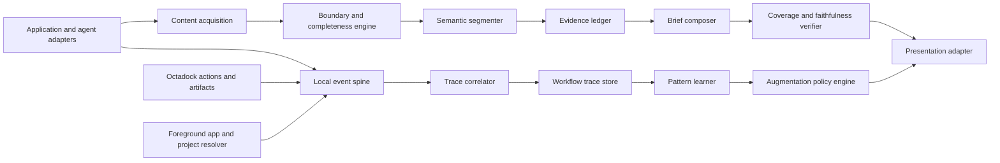

# Octadock Workflow Intelligence

## Technical concept and pre-implementation wargame brief

**Status:** Planning only — not implementation authorization
**Date:** 2026-07-10
**Purpose:** Capture the founder's intended product experience, propose a technically honest architecture, identify what is still unknown, and provide a document that can be adversarially war-gamed before any production work begins.

---

## 1. Executive summary

Octadock should augment the workflow a person already has. It should not ask the person to move into an Octadock workspace, learn a new process, repeatedly choose context, or read another large AI response.

The proposed system has two related capabilities:

1. **Workflow Intelligence** observes how work moves between Octadock, desktop applications, projects, Codex, Claude, builds, captures, clipboard operations, and outcomes. It records local workflow traces and learns repeated handoffs.
2. **Trusted Briefs** detect complete long-form content in another application—including content outside the visible viewport—and present a short, source-linked brief inside or immediately beside the application where the content appeared.

The first high-value use case is long Codex and Claude output. A user continues using those applications normally. When a long response completes, Octadock detects the exact response boundary, obtains the complete structured content where possible, incrementally extracts an evidence ledger, produces a brief, checks coverage, and displays the brief without opening an Octadock window.

This is not a screenshot summarizer. Screenshots and scrolling OCR are fallback acquisition methods. The preferred path is structured, application-specific integration: provider hooks, local transcripts, browser DOM, editor APIs, and Windows UI Automation text ranges.

The system must be built around explicit consent levels. A full-content developer trace mode is acceptable for the founder's internal build, but the raw-content collector should not be compiled into the public build until a separate product, privacy, and legal decision is made.

The central technical risks are:

- obtaining complete and correctly bounded text from heterogeneous applications;
- distinguishing a full document or agent turn from a visible fragment;
- compressing content without silently dropping an important constraint;
- presenting augmentation so it feels native to each host application;
- correlating cross-application events without misidentifying the project or task;
- collecting enough internal evidence to improve the system without creating an uncontrolled recorder.

The first engineering goal is not broad automation. It is to prove, on real Codex and Claude sessions, that Octadock can reconstruct the full content, identify its start and end, produce a source-grounded brief, and measure exactly when it fails.

---

## 2. Founder intent

The product intent, as understood from the planning conversation, is:

- Octadock should feel planted in Windows rather than experienced as a destination application.
- It should augment Codex, Claude, editors, browsers, terminals, and other applications from inside the user's existing workflow.
- Routine use should add no new steps.
- A user should not have to create or name Context, construct a packet, choose a workflow, or open an AI screen.
- Octadock should learn what the user normally does and remove repeated handoffs only after it understands them.
- The founder's internal build may collect full-content traces for debugging and product discovery when the founder grants full consent.
- Public builds should have narrower collectors and consent choices until internal evidence establishes which signals are actually useful.
- Long AI output is an immediate pain: reading it is slow, summaries are often unreliable, and current AI interfaces make the user reconstruct the important points manually.
- Long content may be scrollable and larger than one screen. Octadock must understand the complete logical content, not merely OCR a viewport.
- A useful brief must be dramatically faster to consume without silently omitting important decisions, constraints, warnings, actions, numbers, files, or unresolved questions.

### Proposed product statement

> Octadock is a local-first Windows instrumentation layer that understands how work moves, enriches the next step the user was already going to take, and compresses complexity without pulling the user out of the application they are using.

### Proposed interaction principle

> Ambient in presence; explicit in permission; invisible in routine use.

---

## 3. What the experience should feel like

### 3.1 Long Codex response

The user asks Codex to inspect a repository. Codex produces a long response.

Octadock does not open anything. While the response streams, it incrementally records structured segments and evidence. When the response finishes, a compact native-looking brief appears at the start of that response:

```text
12-minute response → 25-second brief

Main result
• The shelf height regression comes from the fixed minimum row height.
• Three XAML files and one view-model test are affected.
• Capture behavior itself does not need to change.

Must not miss
• Mixed-DPI restoration was not verified.
• One existing test intentionally encodes the old geometry.

Next actions
• Change ShelfItemView.xaml and the shared metric.
• Update the geometry test.
• Run the rendered high-DPI check.
```

Selecting a bullet jumps to or highlights the supporting source range. The original response is unchanged and remains available.

If the response is short, Octadock does nothing.

### 3.2 The workflow learning loop

During an initial observation period, the user behaves normally:

```text
Octadock screenshot
→ switch to Claude
→ paste evidence
→ explain a visual problem
→ Claude changes XAML
→ build Octadock
→ return to Octadock
→ capture the result
```

Octadock records the causal structure, timing, project, provider, file categories, build result, and visual outcome. It does not automate the sequence yet.

After repeated successful traces and explicit project permission, the same screenshot action can prepare or execute the learned path automatically. The screenshot remains the user's existing intentional signal; the model selection, project context, relevant files, and verification no longer require separate steps.

### 3.3 What should remain invisible

There should be no dedicated Workflow Intelligence, AI Workspace, summary dashboard, or Context management screen in routine use.

Settings may contain:

- consent level;
- connected projects and application adapters;
- retention and exclusions;
- provider routing preferences;
- automation permissions;
- an internal diagnostic/export section in the internal build.

History may contain completed artifacts and traces if later found useful, but observability data should not force a new daily workflow.

---

## 4. Working vocabulary

Names are provisional and should not be treated as marketing decisions.

| Term | Meaning |
| --- | --- |
| **Workflow Event** | One timestamped observation, such as a capture, application focus change, agent completion, build result, or file-category change. |
| **Workflow Trace** | A correlated task episode composed of events and timed spans across applications. |
| **Content Document** | A complete logical unit of text, such as one assistant turn, article, email thread, terminal result, file, or document. |
| **Content Segment** | A structured subdivision: heading, paragraph, chat message, code block, list, table row, warning, or tool result. |
| **Source Anchor** | A stable pointer back to the original content: transcript record, DOM node, UI Automation range, file offset, or OCR spatial range. |
| **Evidence Ledger** | A normalized set of decisions, constraints, actions, risks, errors, facts, numbers, references, and unresolved questions extracted from all segments. |
| **Trusted Brief** | A compressed, source-linked representation generated from the ledger and checked for coverage. |
| **Presentation Adapter** | Application-specific mechanism for displaying the brief naturally in or adjacent to the host application. |
| **Consent Profile** | The user's selected collection, retention, processing, and egress permissions. |
| **Augmentation Policy** | A project/application-specific permission describing what Octadock may enrich or automate. |

---

## 5. Scope

### 5.1 In scope for technical discovery

- Local workflow event collection.
- Internal-only full-content trace collection.
- Codex and Claude lifecycle/content adapters.
- Complete assistant-turn reconstruction.
- Browser and Windows text-access feasibility testing.
- UI Automation document and range extraction.
- Scrollable OCR reconstruction as a fallback.
- Semantic segmentation and source anchors.
- Evidence-ledger extraction.
- Hierarchical brief generation.
- Independent coverage and faithfulness checks.
- Application-native or anchored presentation experiments.
- Local trace storage, retention, deletion, and export.
- Instrumentation for extraction and summary accuracy.

### 5.2 Explicitly not assumed

- Universal reliable extraction from every Windows application.
- Perfect inference of user intent from a screenshot alone.
- Guaranteed preservation of literally every detail in a shorter summary.
- Silent external transmission in a public build.
- Automatic repository modification without a separate project permission.
- A new AI or workflow-management window.
- A cloud analytics platform.
- Production release of the internal full-content collector.

---

## 6. Consent and build-flavor model

### 6.1 User-visible consent levels

| Level | Collection | Processing | Intended availability |
| --- | --- | --- | --- |
| **Off** | Nothing beyond data required for the explicit feature currently used. | None. | Public and internal. |
| **Octadock activity only** | Octadock commands, durations, errors, feature actions, artifact IDs. | Local metrics and diagnostics. | Public and internal. |
| **Workflow metadata** | Application identity/category, focus transitions, project ID, provider/model, session state, file categories, build/test outcomes, artifact hashes. No raw application text by default. | Local workflow traces and pattern learning. | Public candidate; not automatically enabled. |
| **Full developer trace** | Raw prompts/responses where available, extracted application text, window titles, screenshots, clipboard content already monitored, repository paths/content within connected projects, agent lifecycle, build/test output. | Local debugging, research, evaluation dataset creation, optional user-selected model processing. | Internal build only. |

### 6.2 Internal/public separation

The internal collector must not be a hidden public setting. Recommended boundary:

- separate build property, for example `OctadockInternalBuild=true`;
- internal-only collector assembly or source set;
- public CI fails if the internal collector, raw-content schema migration, or developer export command is included;
- internal build uses a visually distinct About/Settings label;
- internal trace exports are explicitly marked sensitive;
- public and internal signing/update channels are separate;
- changing the public product to include full collection requires a new review rather than a configuration flip.

### 6.3 Controls that apply even under full consent

- Pause learning/collection immediately.
- Per-application and per-project exclusions.
- Automatic exclusion candidates: password managers, authentication dialogs, private browsing windows, banking, health, remote desktops, protected media, and elevated applications that cannot be safely inspected.
- Configurable raw-data retention.
- Delete all and export all.
- Clear disclosure when content is sent to an external model.
- No accidental inclusion of secrets in logs or crash reports.

---

## 7. High-level architecture



### 7.1 Service boundaries

| Component | Responsibility | Must not do |
| --- | --- | --- |
| **Adapter Host** | Load application/provider adapters and normalize their events. | Make product decisions or silently send data. |
| **Event Spine** | Accept bounded typed events; assign IDs and timestamps; persist safely. | Store unbounded raw objects or arbitrary logs. |
| **Trace Correlator** | Associate events with a project and task episode using evidence and confidence. | Present uncertain correlation as fact. |
| **Content Acquisition** | Obtain structured text and source anchors through the strongest available adapter. | Default to OCR when structured content exists. |
| **Boundary Engine** | Decide start/end/completeness and record confidence/evidence. | Claim completion when only the visible viewport is known. |
| **Evidence Extractor** | Produce typed evidence items from all segments. | Produce final prose or discard unmatched source material. |
| **Brief Composer** | Build progressive-disclosure output from the evidence ledger. | Invent facts not represented by evidence. |
| **Verifier** | Check source support, critical-item coverage, contradictions, and omissions. | Rewrite a failed brief into an apparently successful one without surfacing failure. |
| **Presentation Adapter** | Place the result naturally in a supported host. | Use a large generic Octadock window as the default. |
| **Policy Engine** | Apply consent, egress, routing, and automation permissions. | Infer permission from usage frequency. |

---

## 8. Content acquisition: use the strongest available source

### 8.1 Acquisition hierarchy

| Priority | Method | Boundary quality | Structure quality | Examples |
| --- | --- | --- | --- | --- |
| 1 | Provider/application-native event and transcript adapter | Exact or near-exact | High | Claude hooks/transcripts, Codex task/thread data where supported |
| 2 | Host extension/plugin | Exact | High | Browser DOM extension, VS Code extension |
| 3 | File/document source | Exact | High | Local Markdown, log, JSON, source file, exported conversation |
| 4 | Windows UI Automation `TextPattern` | Provider-dependent | Medium to high | Document/edit controls exposing `DocumentRange` |
| 5 | Accessibility tree without full text range | Partial | Medium | Semantic controls and visible children |
| 6 | Scrollable visual capture plus OCR | Inferred | Low to medium | Unknown applications, canvas-rendered content |
| 7 | Visible screenshot OCR only | Viewport only | Low | Last-resort partial brief with explicit warning |

### 8.2 Source capability contract

Each adapter should report capability rather than merely returning text:

```text
ContentCapability
  sourceKind
  canIdentifyDocument
  canIdentifyLogicalUnit
  canReadOffscreen
  canObserveStart
  canObserveCompletion
  canProduceStableAnchors
  canNavigateToAnchor
  canRenderInline
  confidence
  limitations[]
```

The product must degrade based on these capabilities. A viewport OCR adapter may produce a visible-section brief but must not label it a complete response.

### 8.3 Claude adapter

Claude Code currently exposes lifecycle hook points including session start/end, prompt submission, tool activity, file changes, working-directory changes, completion, and failure. This provides strong boundaries and workflow events. The adapter should ingest the smallest required fields and avoid raw tool arguments unless full developer consent is active.

Open question: which official transcript or hook payload contains the complete assistant output in each Claude mode? This must be verified against the installed version rather than assumed.

### 8.4 Codex adapter

The archived Octadock AI-session implementation previously identified Codex processes, desktop/CLI thread state, workspace, model, and activity from local state and rollout data. That proves local lifecycle observation is feasible, not that the interface is stable or supported.

The adapter should have separate confidence levels:

- official/stable integration, if available;
- documented local task/thread data;
- process and file-state observation;
- terminal/visual fallback.

If only process state is known, Octadock may report `Codex working/completed` but may not claim to possess the complete response.

### 8.5 Browser and web-app adapter

A browser extension can identify article containers, chat turns, headings, code blocks, tables, collapsed content, and stable DOM anchors. It can insert a brief into document flow more naturally than a desktop overlay.

Risks:

- application-specific DOM changes;
- cross-origin frames;
- virtualized lists;
- shadow DOM;
- content loaded only after scrolling;
- private browsing permissions;
- hostile or misleading page content;
- extension-store policy and review.

### 8.6 Windows UI Automation adapter

`TextPattern.DocumentRange` can provide a range enclosing the main document text, while `GetVisibleRanges` provides visible ranges. When the provider exposes a virtualized document's entire text stream, `DocumentRange` can include off-screen content. Providers may omit auxiliary text, return partial information, or invalidate ranges when content changes.

The adapter must test rather than assume:

- `TextPattern` availability;
- complete document versus visible subset;
- stable range endpoints;
- logical order;
- paragraph/line support;
- bounding rectangles;
- navigation back to the source;
- performance on large documents;
- behavior while text is still streaming.

### 8.7 Scrollable OCR fallback

Scrolling OCR is necessary but should not be mistaken for the preferred universal solution.

Proposed pipeline:

1. Identify the scroll viewport and exclude fixed chrome.
2. Capture the initial viewport with physical-pixel coordinates and DPI metadata.
3. OCR lines with text, confidence, language, and bounding boxes.
4. Scroll through `ScrollPattern` when safely supported; otherwise observe user scrolling or use bounded input only under explicit action.
5. Capture the next viewport after visual stability.
6. Detect sticky headers, footers, timestamps, avatars, and controls that repeat across frames.
7. Match overlapping text with normalized line hashes, word shingles, layout coordinates, and image features.
8. Construct an overlap graph and select the highest-confidence monotonic ordering.
9. Deduplicate overlapping lines and preserve alternatives when confidence is low.
10. Stop on a known scroll endpoint, a provider endpoint, repeated terminal content, or a bounded no-new-content condition.
11. Reconstruct logical segments while preserving frame and spatial anchors.
12. Emit completeness evidence and warnings.

Important failure cases:

- virtualized chat messages disappear above the viewport;
- lazy loading changes earlier content;
- animated code blocks or streaming cursors prevent visual stability;
- sticky headers resemble content;
- proportional fonts and wrapped lines change between frames;
- the application jumps rather than scrolls continuously;
- a terminal reflows when resized;
- OCR changes the same word between frames;
- tables repeat column headers;
- an infinite feed has no logical end;
- the user changes the document during collection.

For these cases, `complete=false` is a valid and necessary result.

---

## 9. Boundary and completeness engine

### 9.1 Boundary evidence

The engine should combine independent signals:

- provider start/stop/failure event;
- transcript record IDs and roles;
- DOM message container creation and completion state;
- stable content hash after a quiet interval;
- UI Automation range endpoints;
- application status indicator;
- scroll position and scroll endpoint;
- terminal prompt return;
- file append and close behavior;
- model streaming stop marker;
- temporal separation from the next user turn.

### 9.2 Boundary result

```text
BoundaryResult
  documentId
  logicalUnitKind        // assistant_turn, article, thread, command_output, file
  startAnchor
  endAnchor
  startedAt
  completedAt
  complete               // true only when supported by evidence
  confidence             // 0..1, calibrated per adapter
  evidence[]
  missingCapabilities[]
  warnings[]
```

### 9.3 Confidence policy

- **High:** structured start and end from the same trusted adapter, plus stable content.
- **Medium:** one structured boundary plus reliable document-range or transcript evidence.
- **Low:** inferred from quiet time, viewport stability, or OCR only.

Only high-confidence complete units may receive an unqualified `Trusted Brief`. Medium confidence must disclose the limitation. Low confidence should be labeled `Visible section` or not summarized automatically.

---

## 10. Semantic segmentation and source anchors

The normalizer should preserve structure rather than flattening everything into one string.

Recommended segment types:

- heading;
- paragraph;
- ordered/unordered list;
- user message;
- assistant message;
- system/status message;
- code block;
- diff;
- command/tool invocation;
- command/tool result;
- table and row;
- warning/error;
- quote;
- link/reference;
- image description;
- unknown.

Each segment stores:

```text
ContentSegment
  id
  documentId
  ordinal
  type
  role
  text
  normalizedHash
  sourceAnchor
  parentSegmentId
  language
  confidence
  attributes
```

Anchors are source-specific:

- transcript file + record ID + character offsets;
- DOM document ID + node path + text offsets;
- UI Automation runtime ID + cloned range endpoints;
- file path identity + byte/character offsets;
- OCR frame IDs + bounding polygons + reconstructed offsets.

Anchors must be validated before navigation. A changed document may invalidate an anchor; the UI must then offer search-by-excerpt rather than jumping to the wrong text.

---

## 11. Trusted Brief pipeline

### 11.1 Why one summarization call is insufficient

A single prompt such as `summarize this without missing anything` has no enforceable definition of importance, no measurable coverage, weak provenance, and no reliable way to reveal omissions. A fluent answer can appear trustworthy while missing the one constraint that changes the task.

The system therefore separates extraction, compression, and verification.

### 11.2 Incremental evidence ledger

As segments arrive, the extractor emits typed evidence items:

```text
EvidenceItem
  id
  category
  normalizedStatement
  importance
  sourceAnchors[]
  entityRefs[]
  confidence
  contradictionGroup
  supersedesItemId
```

Required categories:

- outcome/conclusion;
- user request;
- requirement;
- constraint/non-goal;
- decision;
- action/next step;
- completed action;
- risk/warning;
- error/failure;
- unresolved question;
- assumption;
- file/code reference;
- number/date/version/threshold;
- external dependency;
- privacy/security boundary;
- disagreement/contradiction.

The ledger should preserve conflicting or superseded statements rather than resolving them silently.

### 11.3 Hierarchical processing

For long content:

1. Process segments in bounded semantic groups.
2. Produce evidence items, not prose summaries, for each group.
3. Deduplicate semantically equivalent evidence while retaining all source anchors.
4. Resolve explicit supersession only when the source states it.
5. Rank evidence using rules plus a model.
6. Compose a progressive brief.
7. Verify every brief claim against anchors.
8. Check that every high-importance evidence item appears in the brief or `Must not miss`.
9. Surface failed checks and coverage gaps.

### 11.4 Output contract

```text
TrustedBrief
  headline
  estimatedOriginalReadTime
  estimatedBriefReadTime
  mainPoints[]           // normally 1–5
  mustNotMiss[]
  decisions[]
  actions[]
  risksAndUnknowns[]
  filesAndReferences[]
  sourceCoverage
  extractionCompleteness
  confidence
  warnings[]
```

Each displayed item requires at least one valid source anchor.

### 11.5 Coverage and faithfulness verifier

The verifier should be independent from the composing pass where practical. It checks:

- unsupported claims;
- incorrect numbers, filenames, versions, or negations;
- omitted high-importance evidence;
- contradictions hidden by compression;
- action/decision confusion;
- completed versus proposed work;
- uncertain statements presented as facts;
- outdated statements that were later superseded;
- accidental inclusion of untrusted instructions as system facts.

If verification fails, possible outcomes are:

- retry with the failed evidence attached;
- move omitted items into `Must not miss`;
- lower confidence and show the coverage warning;
- withhold the brief when the failure is critical.

### 11.6 Honest limitation

A shorter representation cannot mathematically preserve every detail of arbitrary text. The product should promise measurable critical-item coverage, source traceability, and visible uncertainty—not perfect lossless summarization.

---

## 12. Model strategy

### 12.1 Functions should be routed separately

The following are different model tasks and should not automatically share one provider:

- semantic segmentation fallback;
- evidence extraction;
- importance ranking;
- brief composition;
- source-faithfulness verification;
- workflow classification;
- provider/task routing.

### 12.2 Internal-build options

| Strategy | Advantages | Risks |
| --- | --- | --- |
| Persistent local model | Low-latency, private, can process incrementally | Model download/CPU/GPU cost; weaker recall on complex content |
| Claude | Strong long-context and frontend/product interpretation | External egress, latency/cost, self-evaluation correlation |
| Codex | Strong code/repository reasoning | May not be the best compression model; CLI startup and isolation costs |
| Hybrid | Local extraction/cache; configured model composes; independent verifier checks | More architecture and more failure modes |

Recommended experiment: use deterministic normalization, incremental structured extraction, and caching locally; compare Claude, Codex, and at least one local model on the same labeled dataset. Choose by measured critical-fact recall and latency, not preference alone.

### 12.3 Streaming strategy

For provider-native adapters, process completed semantic blocks as the source streams. Do not repeatedly summarize the entire growing response.

At completion:

- finalize the last segment;
- merge/deduplicate evidence;
- resolve explicit supersession;
- compose the final brief;
- run coverage verification.

This should make most work complete before the user reaches the end of the original response.

---

## 13. Native presentation

### 13.1 Principle

The intelligence engine can be universal; truly native presentation cannot. Application-specific adapters are required.

### 13.2 Presentation hierarchy

1. **Inline host integration:** insert a compact brief into the application's document/message flow.
2. **Host extension surface:** editor decoration, browser content insertion, terminal integration, or provider status component.
3. **Anchored no-activate overlay:** follows the host window and source range without stealing focus.
4. **Capsule result:** last resort when anchoring is unreliable.

### 13.3 Desired behavior

- Appears only when the estimated reading burden crosses a threshold.
- Does not cover the text the user is reading.
- Uses the host application's density, typography, and light/dark state where technically possible.
- Starts collapsed to the smallest useful brief.
- Clicking a point navigates to evidence.
- Automatically dismisses or becomes unobtrusive when focus changes.
- Never forces an Octadock workspace open.
- Remains keyboard and screen-reader accessible.

### 13.4 Hard truth

Without a browser/editor/provider extension, Octadock cannot literally become part of another application's layout. An overlay can feel integrated but remains an overlay. The wargame must decide whether this is acceptable for Codex Desktop and Claude interfaces or whether official integration points are required before the feature is viable.

---

## 14. Workflow observation and learning

### 14.1 Event model

Example event families:

```text
octadock.capture.started/completed/failed
octadock.artifact.copied/pinned/annotated/ocr/dragged
octadock.dictation.started/completed/inserted
app.focus.changed
system.idle.started/ended
project.detected/changed
agent.session.started/resumed/waiting/completed/failed
agent.turn.started/completed
workspace.files.changed
build.started/completed
test.started/completed
git.branch.changed
git.diff.changed
artifact.transferred
visual.comparison.completed
augmentation.offered/accepted/ignored/overridden/failed
```

### 14.2 Correlation evidence

A trace correlator may use:

- explicit provider trace/session IDs;
- project root or workspace ID;
- artifact hashes;
- active application and timing;
- capture provenance;
- clipboard provenance;
- file changes and branch;
- provider working directory;
- user action sequence;
- build/test process ancestry;
- source anchors.

Every trace association stores confidence and reasons. Low-confidence events remain unassigned rather than being forced into the nearest task.

### 14.3 Learning progression

1. **Observe:** no workflow changes.
2. **Enrich:** improve an action the user already performs, such as preparing complete context for an existing paste.
3. **Predict:** adapt the default existing action to the likely destination.
4. **Automate:** execute a repeated path under an explicit project policy.
5. **Close the loop:** verify the outcome through build, test, visual comparison, or user acceptance.

Frequency does not grant permission. Consent and augmentation policies remain separate from learned confidence.

---

## 15. Proposed data model

The names and exact schema are provisional.

### 15.1 Core entities

```text
ConsentProfile
  id, level, isInternalBuild, retention, excludedApps, excludedProjects,
  allowExternalProcessing, providerRules, updatedAt

WorkflowEvent
  id, timestamp, kind, instrumentationScope, appId, projectId,
  traceId?, spanId?, artifactId?, contentDocumentId?, privacyClass,
  confidence, attributesJson

WorkflowTrace
  id, projectId?, taskClass?, startedAt, endedAt?, status,
  correlationConfidence, correlationEvidenceJson, outcome

WorkflowSpan
  id, traceId, parentSpanId?, kind, source, startedAt, endedAt?,
  status, attributesJson

ContentDocument
  id, sourceAdapter, logicalUnitKind, identityHash, startedAt,
  completedAt?, complete, boundaryConfidence, sourceVersion,
  encryptedRawContentRef?, warningsJson

ContentSegment
  id, documentId, ordinal, type, role, normalizedHash,
  encryptedTextRef?, sourceAnchorJson, confidence

EvidenceItem
  id, documentId, category, normalizedStatement,
  importance, confidence, anchorsJson, contradictionGroup?

TrustedBrief
  id, documentId, version, briefJson, coverageMetricsJson,
  verifierResultJson, modelProfile, createdAt

AugmentationPolicy
  id, scopeKind, scopeId, triggerPattern, allowedAction,
  provider, permissionBoundary, enabled, createdByUserAt
```

### 15.2 Raw content separation

Raw content should not be embedded casually in general event JSON. Use a separate encrypted content store with explicit privacy classification and retention. Metadata events remain useful after raw content expires.

### 15.3 Cardinality and growth

Foreground focus events and streaming-agent events can create high volume. The implementation should:

- coalesce focus intervals rather than recording repeated identical focus events;
- store state transitions, not every poll;
- sample performance diagnostics separately;
- cap unrecognized adapter metadata;
- bound attributes and raw payload sizes;
- checkpoint and compact safely;
- calculate expected storage before enabling full capture.

---

## 16. Security, privacy, and data safety

### 16.1 Threats

- Raw prompts contain secrets, customer data, credentials, or private conversations.
- A hostile page or document attempts prompt injection through captured text.
- One application is incorrectly associated with another project's trace.
- A public build accidentally includes internal collection capability.
- Trace exports are shared without understanding their sensitivity.
- The summary model receives data outside the allowed egress policy.
- Logs or crash reports copy raw content.
- An adapter reads another user's/elevated process data.
- Retention deletes metadata but leaves raw blobs or temporary files.

### 16.2 Proposed controls

- Internal collector excluded from public builds by CI-verifiable artifact inspection.
- Local encryption with Windows user-bound key protection; exact implementation requires security review.
- Separate metadata and raw-content stores.
- Purpose and privacy classification on every event/document.
- Adapter allowlist and explicit capabilities.
- Secret detection before external processing and export.
- Untrusted-source framing for all model processing.
- No raw content in normal diagnostic logs.
- Atomic writes, bounded queues, crash recovery, and complete retention cleanup.
- Export requires an explicit destination and manifest of included data.
- Per-source and per-project egress policy.
- No silent provider fallback.
- Red-team test corpus containing prompt injection, credentials, invisible text, and misleading source labels.

---

## 17. Performance and reliability targets

Targets below are provisional experiment gates, not production promises.

| Area | Provisional gate |
| --- | --- |
| Idle overhead | No continuous OCR; near-zero CPU outside enabled adapter events; measure rather than assume. |
| Agent-stream processing | Bounded queue; must not delay or interfere with the host agent. |
| Brief latency | Target under 3 seconds after a structured agent completion when incremental extraction is active; under 10 seconds for the first prototype. |
| UI Automation | Time-bounded calls with process isolation or cancellation strategy; a hung provider must not hang Octadock. |
| Scroll OCR | User-cancellable, memory-bounded, explicit partial result on failure. |
| Storage | Daily estimate and retention enforcement tested with full developer traces. |
| Recovery | Corrupt or partial trace must not damage captures, clipboard history, or settings. |
| Presentation | Must not steal focus, alter host input, or move the host window. |

---

## 18. Evaluation metrics

### 18.1 Extraction

- **Boundary accuracy:** correct start and end logical unit.
- **Segment recall:** expected messages/paragraphs/code blocks recovered.
- **Text completeness:** recovered normalized content compared with structured ground truth.
- **Ordering accuracy:** segments reconstructed in correct logical order.
- **Duplicate rate:** repeated content after scrolling reconstruction.
- **Anchor validity:** displayed claims successfully navigate to their source.

### 18.2 Brief quality

- **Critical-item recall:** labeled critical evidence represented in `Main`, `Must not miss`, `Actions`, or `Risks`.
- **Unsupported-claim rate:** brief claims lacking a valid source anchor.
- **Numeric/entity accuracy:** exact preservation of numbers, filenames, versions, dates, and negations.
- **Contradiction visibility:** conflicting important statements surfaced rather than flattened.
- **Compression ratio:** original estimated read time versus brief read time.
- **Decision usefulness:** user can correctly state the outcome and next action after reading only the brief.

### 18.3 Naturalness

- Additional routine actions introduced: target zero.
- Focus interruptions caused by Octadock.
- Brief dismiss/ignore rate.
- Evidence-navigation use.
- User corrections to a brief.
- Times the user returns to read the full content because the brief was insufficient.

### 18.4 Workflow intelligence

- Trace correlation precision.
- Known project/provider/outcome coverage.
- Provider-routing accuracy.
- Manual handoffs removed.
- Time from source event to verified outcome.
- Automation override and reversal rate.

### 18.5 Trust guardrails

- Unintended external send: zero tolerance.
- Raw content present in a public build: zero tolerance.
- Sensitive-content leak to logs/exports: zero tolerance.
- Incorrect automation crossing a write boundary: zero tolerance.

---

## 19. Existing Octadock foundations

Potentially reusable:

- `CaptureSource` already stores process/window provenance for captures.
- The `actions` table and `ActionType` model already create a capture action timeline.
- Clipboard provenance identifies foreground source application/window.
- Local OCR and OCR history exist.
- Manual vertical scrolling capture and overlap stitching exist, though reliability is partial and automatic scrolling is unsupported.
- Visual comparison produces deterministic change metrics and a heat map.
- Agent packet code contains bounded attachments, hashing, redaction, untrusted-source framing, and explicit provider boundaries.
- Archived AI-session discovery previously implemented process creation/exit observation, Claude/Codex activity watchers, workspace detection, and change events.
- The read-aloud discovery proposal already describes screen maps, local OCR blocks, grouping, caching, and low-frequency discovery.

Important gaps:

- no current workflow event spine spanning all features;
- AI-session schema and UI were deliberately removed;
- no canonical content-document or source-anchor model;
- no UI Automation `TextPattern` document extractor;
- no browser/editor adapters;
- no complete assistant-turn boundary engine;
- no evidence ledger or coverage verifier;
- no internal/public build-flavor boundary for full-content collection;
- no calibrated definition of successful workflow correlation;
- no native presentation adapter for Codex or Claude.

### Documentation conflict to resolve if the concept survives

Current product strategy explicitly rejects passive AI/session discovery and screen watching. This concept should not silently reverse that decision. If the internal observation system proves valuable, documentation must distinguish:

- internal consented research instrumentation;
- public metadata-only workflow learning, if later approved;
- prohibited undisclosed screen watching or raw-content collection.

---

## 20. Proposed technical discovery sequence

No application implementation should begin until the early experiments answer the blocking questions.

### Phase 0 — Ground-truth corpus

- Collect 20–50 real long Codex and Claude outputs under full developer consent.
- Preserve structured transcript/source as ground truth.
- Label logical boundaries, segments, critical facts, decisions, actions, constraints, risks, files, numbers, and contradictions.
- Include short messages, very long messages, code-heavy output, tool traces, failures, interrupted turns, corrections, and resumed sessions.

**Exit:** reviewed corpus and scoring script design exist.

### Phase 1 — Adapter feasibility harness

- Build an isolated diagnostic harness, not an Octadock product surface.
- Test Claude hooks/transcript completeness.
- Test Codex state/transcript/task availability and stability.
- Test UI Automation capability on Codex Desktop, Claude interfaces, browsers, terminals, VS Code, Notepad, Word, and representative WPF applications.
- Record exact capability matrices and failure evidence.

**Exit:** at least one Codex or Claude path reconstructs complete turns with stable boundaries and anchors.

### Phase 2 — Scroll reconstruction experiment

- Reuse or isolate the existing scrolling stitcher.
- Add OCR line boxes, overlap graph, sticky-region detection, deduplication, and completeness reporting.
- Test against ground truth in applications where structured extraction is unavailable.

**Exit:** known supported-app matrix and honest partial-result behavior. This path does not block native adapters.

### Phase 3 — Evidence and brief evaluation

- Implement an offline corpus runner.
- Compare model/provider strategies.
- Score critical-item recall, unsupported claims, numeric accuracy, contradiction visibility, and latency.
- Have the founder evaluate whether briefs materially reduce reading time.

**Exit:** the system meets agreed gates on held-out real sessions.

### Phase 4 — Presentation experiment

- Prototype one inline/extension path and one anchored-overlay path.
- Verify focus, scrolling, resizing, DPI, accessibility, theming, and source navigation.
- Test whether the feature feels like Codex/Claude functionality rather than an Octadock popup.

**Exit:** founder accepts the interaction without learning a new workflow.

### Phase 5 — Internal workflow trace system

- Add internal build flavor and consent profile.
- Add typed event spine, trace correlator, encrypted raw store, retention, pause, exclusions, and export.
- Instrument Octadock plus proven Codex/Claude adapters.
- Observe without automating.

**Exit:** traces accurately explain real work and can be deleted/exported completely.

### Phase 6 — Enrichment and learning

- Learn repeated transitions.
- Enrich an action the user already performs.
- Measure correction, interruption, and time saved.
- Keep automatic writes out of scope until enrichment works reliably.

---

## 21. Wargame objective

Determine whether the proposed system can become a trustworthy, application-native workflow augmentation layer or whether extraction uncertainty, summary loss, privacy cost, integration fragility, or UX mismatch makes the concept unviable.

The wargame should produce:

- a pass / pass-with-changes / fail verdict for each scenario;
- P0 blockers;
- required technical experiments;
- revised internal/public scope;
- adapter priority;
- consent and retention policy;
- metric definitions and kill criteria;
- a decision on whether to proceed to an isolated harness.

---

## 22. Wargame roles

- **Founder / Workflow Owner:** protects the no-new-steps and native-feeling goal.
- **Windows Platform Engineer:** attacks UI Automation, focus, DPI, process, accessibility, and overlay assumptions.
- **Extraction Engineer:** attacks boundaries, ordering, virtualization, OCR, and anchors.
- **AI Evaluation Lead:** attacks summarization, coverage, faithfulness, and measurement.
- **Security/Privacy Reviewer:** attacks full-content collection, encryption, export, retention, injection, and public-build separation.
- **Codex Adapter Reviewer:** challenges the stability and supportability of Codex data sources.
- **Claude Adapter Reviewer:** challenges hook/transcript coverage and version changes.
- **UX/Accessibility Reviewer:** challenges whether augmentation is actually native, readable, dismissible, keyboard accessible, and non-disruptive.
- **Performance Reviewer:** attacks idle overhead, streaming cost, storage growth, hung providers, and battery use.
- **Maintainer:** attacks adapter churn, test burden, data migrations, and long-term complexity.
- **Skeptical Customer:** asks why they should trust a system that reads other applications.

---

## 23. Wargame scenarios

### Scenario 1 — A 10,000-word Codex response

**Intent:** Understand the result in under one minute without losing implementation constraints.

Stress:

- Does the adapter capture the complete turn or only rendered messages?
- Are tool outputs and final answer separated correctly?
- Are later corrections allowed to supersede earlier statements?
- Are filenames, line numbers, test results, and negations exact?
- Is the brief ready when the response ends?
- Can each claim navigate to the source?

**Fail condition:** any labeled critical constraint is omitted or changed without a visible coverage warning.

### Scenario 2 — Claude edits while streaming a long explanation

**Intent:** Understand what changed, what remains, and what must be reviewed.

Stress:

- Hook order versus displayed-message order.
- File changes occur before the final text.
- The final answer claims a test passed when the tool failed.
- A user interruption causes a second completion event.
- A compacted/resumed session changes transcript identity.

**Fail condition:** the brief confuses proposed actions, completed actions, and verified outcomes.

### Scenario 3 — Scrollable virtualized chat

**Intent:** Brief an entire conversation when older messages are removed from the visual tree.

Stress:

- UI Automation returns visible content only.
- DOM nodes are recycled.
- Scrolling loads older messages lazily.
- Duplicate messages appear after reconstruction.
- The conversation has no clear logical beginning.

**Fail condition:** Octadock calls a partial reconstruction complete.

### Scenario 4 — OCR-only unknown application

**Intent:** Brief a long document with no structured text interface.

Stress:

- Sticky headers and repeated table columns.
- Wrapped text and changing viewport width.
- OCR disagreement between overlapping frames.
- Infinite scroll.
- Images containing essential labels.

**Fail condition:** ordering or duplication errors are hidden from the user.

### Scenario 5 — Summary omits one dangerous constraint

**Intent:** Detect whether the verifier protects against fluent but unsafe compression.

Stress corpus includes:

- `do not change existing capture behavior`;
- `never upload this file`;
- `the test is expected to fail`;
- negative requirements;
- a later correction to an earlier instruction;
- a critical number buried in a code block.

**Fail condition:** any labeled high-criticality constraint is absent from both the brief and the warning state.

### Scenario 6 — Summary invents certainty

**Intent:** Preserve uncertainty and disagreement.

Stress:

- source says `likely`, `not verified`, or `I could not reproduce`;
- two agents disagree;
- build output is missing;
- a test was not run;
- the conclusion depends on an assumption.

**Fail condition:** uncertain or conflicting evidence becomes an unqualified conclusion.

### Scenario 7 — Wrong project correlation

**Intent:** Prevent one app transition from contaminating another project.

Stress:

- two Codex tasks open;
- two repositories share similar names;
- user copies a screenshot from one project while another IDE has focus;
- Claude changes working directory mid-session;
- a build process belongs to a different repository.

**Fail condition:** content or automation is attached to the wrong project without user-visible uncertainty.

### Scenario 8 — Full developer trace captures a secret

**Intent:** Prove internal observability does not become uncontrolled leakage.

Stress:

- API key in terminal output;
- password manager focus;
- private browser window;
- customer data in a screenshot;
- trace export;
- crash during retention cleanup;
- external summarizer configured.

**Fail condition:** secret reaches a normal log, unintended provider, public artifact, or undeleted residual file.

### Scenario 9 — Public-build contamination

**Intent:** Prove the internal collector cannot ship accidentally.

Stress:

- release built from a dirty tree;
- feature flag disabled but assembly present;
- migration contains raw-content tables;
- developer command remains callable;
- update changes channels;
- settings import enables an unknown consent level.

**Fail condition:** public artifacts can enable or invoke full developer capture.

### Scenario 10 — Application update breaks integration

**Intent:** Test adapter maintenance and degradation.

Stress:

- DOM structure changes;
- hook payload changes;
- local transcript format changes;
- UI Automation provider stops exposing `DocumentRange`;
- source anchors become invalid.

**Fail condition:** the adapter continues producing apparently complete briefs from degraded partial input.

### Scenario 11 — Augmentation feels like an Octadock popup

**Intent:** Validate the core native-feeling promise.

Stress:

- host moves/resizes/scrolls;
- light/dark theme changes;
- 175% DPI and multiple monitors;
- keyboard-only and screen-reader use;
- summary appears while the user is typing;
- overlay steals focus or covers the response.

**Fail condition:** the founder must manage or dismiss a separate Octadock surface during normal reading.

### Scenario 12 — Too much automation too early

**Intent:** Ensure learning does not mistake repetition for permission.

Stress:

- user usually sends frontend captures to Claude but this capture is archival;
- routing confidence is high but intent is different;
- previous successful pattern is no longer desired;
- model/provider is unavailable;
- write-enabled task would touch unrelated files.

**Fail condition:** Octadock sends externally or modifies a workspace outside an explicit augmentation policy.

### Scenario 13 — Very short and low-value content

**Intent:** Ensure Octadock knows when to do nothing.

Stress:

- two-paragraph answer;
- simple success notification;
- long code block the user needs verbatim;
- repetitive logs that are better filtered than summarized;
- response already has a good executive summary.

**Fail condition:** the system adds clutter or a worse redundant summary.

### Scenario 14 — Performance collapse

**Intent:** Protect the host workflow.

Stress:

- several agent sessions stream simultaneously;
- UI Automation provider hangs;
- 100,000-word transcript;
- OCR on a 4K high-DPI display;
- laptop on battery;
- storage reaches retention limit;
- Octadock crashes mid-write.

**Fail condition:** host apps lag, focus/input is disturbed, or Octadock's core capture/voice functions become unreliable.

---

## 24. Provisional kill criteria

The project should stop, narrow, or change direction if any of the following remain true after focused experiments:

- No supported Codex or Claude path can reliably obtain complete assistant-turn content and boundaries.
- Extraction completeness cannot be measured against ground truth.
- Held-out critical-item recall is below the agreed threshold and failures are not reliably detected.
- Unsupported claims cannot be held near zero.
- The only workable presentation is a separate generic Octadock window.
- Adapter maintenance requires scraping unstable private formats without a safe degradation strategy.
- Full-content collection cannot be reliably excluded from public artifacts.
- Incremental processing interferes with the host agent or creates unacceptable resource usage.
- Users cannot understand when a brief is partial or uncertain.
- Workflow correlation attaches events or content to the wrong project at an unacceptable rate.
- The feature saves less time than it introduces in interruptions and review.

Provisional numeric gates for the first corpus—not promises:

- 100% recall of manually labeled P0 constraints on the small internal evaluation set;
- at least 99% normalized text recovery for structured transcript adapters;
- zero unsupported high-impact claims;
- 100% numeric/filename accuracy for brief items selected from structured evidence;
- source navigation succeeds for at least 99% of displayed claims before document mutation;
- brief available within 10 seconds after completion in the prototype;
- zero focus steals or unintended host input during the presentation test.

These thresholds must be revisited after measuring corpus-label quality and task diversity.

---

## 25. Blocking unknowns

| Question | Why it matters | How to answer |
| --- | --- | --- |
| What complete structured content can be obtained from the installed Codex Desktop/CLI versions? | Determines whether Codex can have exact boundaries/anchors or only a lower-confidence adapter. | Build read-only diagnostic harness; compare with displayed ground truth. |
| Which Claude hook/transcript sources contain complete assistant content in each mode? | Lifecycle events alone may not contain the full response. | Inspect documented hook payloads and real local sessions under full consent. |
| Can a brief be rendered truly inline in Codex/Claude? | Native-feeling interaction may require extension support that does not exist. | Prototype host-specific insertion; otherwise evaluate anchored overlay honestly. |
| What is `important` for this user and task? | Coverage cannot be measured without an explicit rubric. | Label real sessions; define categories and P0/P1 importance with the founder. |
| Which model/pipeline gives the best recall/latency? | Preference is not evidence. | Run the same held-out corpus through local, Claude, Codex, and hybrid pipelines. |
| How long may raw internal traces be kept? | Affects research value, risk, and storage. | Measure daily volume; choose a short default and manual preserve/export. |
| Is workflow observation internal research or a future product pillar? | Changes product strategy, documentation, consent, and architecture. | Decide only after observation data proves value. |
| Can cross-app task correlation reach high precision without content? | Determines usefulness of metadata-only public mode. | Compare inferred traces with manually labeled traces. |

---

## 26. Recommended first decision

Do not begin with universal Windows extraction or automatic workflow orchestration.

Begin with an isolated internal evaluation harness for **complete long-turn capture and Trusted Brief generation in Codex and Claude**. This is the smallest experiment that tests the hardest claims:

- exact start/end detection;
- off-screen completeness;
- incremental processing;
- evidence coverage;
- source navigation;
- native presentation;
- full-consent internal instrumentation.

If this works, its event spine, adapters, anchors, ledger, verifier, and consent model become foundations for broader workflow intelligence. If it fails, Octadock avoids building an expensive generalized surveillance and automation system on top of unreliable content acquisition.

---

## 27. Wargame output template

### Executive verdict

- Overall verdict: Pass / Pass with changes / Fail
- Strongest product opportunity:
- Biggest unsupported assumption:
- Biggest extraction risk:
- Biggest summary risk:
- Biggest privacy/security risk:
- Biggest native-UX risk:
- Recommended next experiment:

### Scenario result

```text
Scenario:
Verdict:
Expected user experience:
Observed/plausible failure:
Evidence:
Severity: P0 / P1 / P2 / P3
Confidence: High / Medium / Low
Required plan change:
Experiment or test:
Owner:
```

### Risk register

| Risk | Area | Severity | Likelihood | Evidence | Mitigation | Verification | Owner |
| --- | --- | --- | --- | --- | --- | --- | --- |
|  | Extraction / AI / Privacy / UX / Platform / Performance / Product |  |  |  |  |  |  |

### Decision log

| Decision | Options considered | Choice | Evidence | Revisit trigger |
| --- | --- | --- | --- | --- |
|  |  |  |  |  |

### Experiment backlog

| Priority | Hypothesis | Cheapest valid experiment | Success metric | Kill condition |
| --- | --- | --- | --- | --- |
|  |  |  |  |  |

---

## 28. References reviewed

### Repository

- `docs/specs/read-aloud-screen-discovery.md`
- `docs/archive/ai-session-discovery-v2.md`
- `docs/PRODUCT-STRATEGY-2026-07.md`
- `docs/specs/AGENT-WORKSPACE.md`
- `docs/CAPABILITIES.md`
- `src/Octadock.Core/Models/CaptureSource.cs`
- `src/Octadock.Core/Models/ActionType.cs`
- `src/Octadock.Platform.Windows/Recording/ScrollingSession.cs`
- `src/Octadock.Platform.Windows/Recording/ScrollingCaptureEngine.cs`
- current OCR, clipboard provenance, agent packet, and visual comparison implementation.

### External primary documentation

- Microsoft UI Automation Text and TextRange patterns:
  <https://learn.microsoft.com/en-us/windows/win32/winauto/uiauto-about-text-and-textrange-patterns>
- Microsoft `TextPattern.DocumentRange`:
  <https://learn.microsoft.com/en-us/dotnet/api/system.windows.automation.textpattern.documentrange>
- Microsoft `TextPattern.GetVisibleRanges`:
  <https://learn.microsoft.com/en-us/dotnet/api/system.windows.automation.textpattern.getvisibleranges>
- Claude Code hooks lifecycle and payload documentation:
  <https://code.claude.com/docs/en/hooks>
- OpenTelemetry trace/span concepts used as inspiration for workflow traces:
  <https://opentelemetry.io/docs/specs/otel/overview/>
- European Commission data-processing principles:
  <https://commission.europa.eu/law/law-topic/data-protection/rules-business-and-organisations/principles-gdpr/overview-principles/what-data-can-we-process-and-under-which-conditions_en>

---

## 29. Planning status

This document deliberately contains hypotheses, provisional thresholds, and unresolved questions. It is intended to be attacked. It does not authorize changes to the Octadock application, documentation, telemetry policy, or public product scope.
